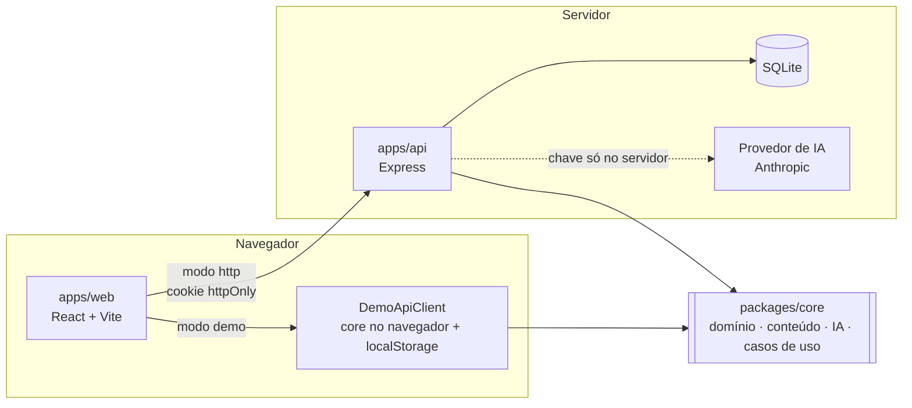

# English AI — Plataforma de aprendizado de inglês com Inteligência Artificial

> **Projeto acadêmico — MVP em desenvolvimento.**

Aulas curtas, conversa com uma IA e correções que explicam o porquê — com explicações em português quando
você precisa. Um **Modo Aprender** para estudar com estrutura e um **Modo Conversação** para praticar sem medo
de errar, no mesmo lugar.

| Celular | Desktop |
| --- | --- |
|  |  |

---

## Sumário

- [Proposta](#proposta)
- [Funcionalidades](#funcionalidades)
- [Como a IA funciona](#como-a-ia-funciona)
- [Arquitetura](#arquitetura)
- [Tecnologias](#tecnologias)
- [Estrutura de pastas](#estrutura-de-pastas)
- [Instalação e execução](#instalação-e-execução)
- [Variáveis de ambiente](#variáveis-de-ambiente)
- [Modo mock (demonstração)](#modo-mock-demonstração)
- [Integração com IA real](#integração-com-ia-real)
- [Segurança e privacidade](#segurança-e-privacidade)
- [Testes](#testes)
- [Protótipo e design](#protótipo-e-design)
- [Documentação](#documentação)
- [Limitações conhecidas](#limitações-conhecidas)
- [Roadmap](#roadmap)

## Proposta

**Problema.** Quem começa a estudar inglês — principalmente brasileiros — não sabe por onde começar, tem pouca
prática de conversação, tem receio de errar, recebe explicações que não combinam com o próprio nível e encontra
conteúdos espalhados e pouco personalizados.

**Objetivo.** Uma plataforma, com foco inicial no celular, que combina **ensino estruturado, IA, conversação e
acompanhamento de progresso** em um só ambiente. A IA é uma **ferramenta pedagógica**, não apenas um chatbot.

O escopo, as decisões e o que ficou fora do MVP estão em [docs/MVP-SCOPE.md](docs/MVP-SCOPE.md).

## Funcionalidades

| Área | O que a pessoa pode fazer |
| --- | --- |
| Conta | criar conta, entrar, sair, recuperar senha (envio simulado), excluir conta e dados |
| Configuração inicial | informar objetivo, como avalia o próprio inglês, experiência anterior e interesses |
| Nivelamento | teste adaptativo em etapas com resultado como **nível estimado** (Iniciante, Básico, Intermediário, Avançado); pode pular |
| Início | "Continuar de onde parei", revisões pendentes, meta do dia, sequência de estudos, palavras recentes |
| Modo Aprender | 12 aulas próprias em trilha por nível, explicação, "Explicar de outro jeito", exemplos, vocabulário e 65 exercícios com feedback imediato |
| Modo Conversação | 8 assuntos (com recomendações pelo perfil), conversa com contexto, correções discretas e feedback ao final |
| Revisão | fila com o motivo de cada item (erros, nota baixa, repetição espaçada, conversa, palavras) |
| Vocabulário | palavras estudadas com tradução, exemplos, busca e filtros |
| Progresso | nível estimado, aulas, exercícios, taxa de acertos, tempo, sequência, últimos 7 dias, desempenho por tema e erros recorrentes |
| Preferências | idioma das explicações, intensidade das correções, tamanho das respostas, tradução, meta diária, histórico de conversas |
| Privacidade | ver dados coletados e finalidade, apagar conversas, desativar histórico, excluir conta |

### Modo Aprender

Ensino estruturado: **aula → explicação → exemplos → vocabulário → exercícios → correção → resumo → revisão**.
Os exercícios fechados são corrigidos por gabarito; a escrita livre é analisada por regras gramaticais e pela IA.
Todo erro mostra o formato pedagógico:

> **Sua frase:** She ~~go~~ to school every day.
> **Forma recomendada:** She **goes** to school every day.
> **Explicação:** Com "he", "she" e "it", normalmente adicionamos "-s" ao verbo no presente simples.

### Modo Conversação

Prática natural com a **Lumi**, a parceira de conversa. Princípio: **NATURALIDADE > CORREÇÃO EXCESSIVA**.
A Lumi reage ao que você disse, faz uma pergunta por vez, lembra o que você contou e reformula seus erros dentro da
própria resposta. Quando uma correção aparece, ela é discreta e opcional:

> **You said:** I have 25 years. · **More natural:** I am 25 years old. · *Por quê?*

Ao encerrar, o resumo reúne os pontos para praticar, sugere aulas e cria revisões.

## Como a IA funciona

- **Uma interface, vários provedores.** A aplicação depende só de `AIService` (`conversation`, `explain`,
  `correct`, `anotherExample`, `generateExercise`). Há duas implementações: o **modo demonstração** (sem chave,
  sem custo) e um serviço para modelos de linguagem reais com **fallback automático** para o modo demonstração.
- **A aplicação decide, a IA ajuda.** O que corrigir e quando mostrar fica em código (`correctionPolicy.ts`),
  não no modelo. Problemas apontados pelo modelo só são aceitos se o trecho citado existir na mensagem.
- **Adaptação por nível** (`levelPolicy.ts`): idioma das explicações, tamanho das frases, tradução de apoio e
  vocabulário mudam do Iniciante ao Avançado.
- **Intensidade das correções** escolhida pela pessoa: Leve, Equilibrada (padrão) ou Detalhada.
- **Privacidade:** só o primeiro nome e dados de aprendizagem vão para a IA; e-mails, telefones, CPF e cartões
  digitados nas mensagens são removidos antes de salvar e de enviar.

Detalhes: [docs/IA-BEHAVIOR.md](docs/IA-BEHAVIOR.md) e [docs/AI-PROMPT-STRATEGY.md](docs/AI-PROMPT-STRATEGY.md).

## Arquitetura



- **`packages/core`** — regras de negócio, conteúdo pedagógico, camada de IA e casos de uso (UC01–UC12), sem
  depender de framework, banco ou provedor (portas e adaptadores).
- **`apps/api`** — API HTTP que implementa as portas com SQLite, autenticação segura e o provedor real de IA.
- **`apps/web`** — interface mobile first. Funciona em dois modos: **demo** (roda o core no navegador, sem
  backend) e **http** (usa a API).

Documento completo: [docs/ARCHITECTURE.md](docs/ARCHITECTURE.md). Modelo de dados (DER e diagrama de classes):
[docs/DATABASE-MODEL.md](docs/DATABASE-MODEL.md).

## Tecnologias

| Camada | Tecnologias |
| --- | --- |
| Linguagem | TypeScript (modo estrito), Node.js ≥ 22.13 |
| Web | React 19, Vite, React Router, TanStack Query, CSS Modules, Lucide (ícones), fontes Fraunces e Atkinson Hyperlegible Next |
| API | Express 5, `node:sqlite`, zod, helmet, express-rate-limit, JSON Web Token em cookie httpOnly, scrypt |
| IA | SDK oficial da Anthropic (opcional), modo demonstração próprio |
| Testes | Vitest, Testing Library, jsdom, Supertest, Playwright (ponta a ponta) |
| Monorepo | npm workspaces |

## Estrutura de pastas

```text
.
├── apps/
│   ├── api/          API HTTP (Express + SQLite), segurança, provedor de IA
│   └── web/          aplicação web mobile first (protótipo navegável)
├── packages/
│   └── core/         domínio, conteúdo, IA e casos de uso compartilhados
├── e2e/              testes de ponta a ponta (Playwright) nos modos demonstração e http
├── docs/             arquitetura, IA, fluxos, escopo, UX, modelo de dados, rastreabilidade
├── design/           design system, componentes, telas, guia do Figma, capturas
├── .env.example      variáveis de ambiente (sem segredos)
└── package.json      scripts do monorepo
```

## Instalação e execução

Pré-requisitos: **Node.js 22.13 ou superior** (há um `.nvmrc`) e npm.

```bash
git clone https://github.com/Helio965/language-tool.git
cd language-tool
npm install
```

### Opção 1 — Protótipo navegável (recomendado para avaliar)

Não precisa de backend, banco nem chave de API.

```bash
npm run dev
```

Abra <http://localhost:5173>. Na tela inicial, clique em **"Explorar demonstração com dados de exemplo"** para
entrar como **Alex** (objetivo Conversar, nível Básico, com histórico de estudos) ou crie uma conta nova para
fazer o fluxo completo (cadastro → configuração → nivelamento → aulas → conversa).
Conta demo: `alex@demo.englishai.app` / `demo1234`. Os dados ficam só no navegador.

### Opção 2 — Aplicação completa (web + API + SQLite)

```bash
cp .env.example .env      # opcional em desenvolvimento
npm run dev:full
```

Sobe a API em <http://localhost:3333> e a web em <http://localhost:5173> (modo `http`, com proxy para `/api`).
O banco SQLite é criado em `apps/api/data/` (ignorado pelo git).

### Build de produção

```bash
npm run build             # typecheck + build da API + build da web
npm run start:api         # API compilada (exige AUTH_TOKEN_SECRET com NODE_ENV=production)
npm run preview           # pré-visualiza o build da web
```

Para a API servir também a interface, gere a web no modo http
(`npm run build -w @english-ai/web -- --mode http`) e defina `WEB_DIST_PATH=../web/dist` no `.env`.

### Scripts

| Comando | O que faz |
| --- | --- |
| `npm run dev` | web em modo demonstração |
| `npm run dev:api` | só a API (com recarga) |
| `npm run dev:full` | API + web em modo http |
| `npm run build` | typecheck e build de tudo |
| `npm test` | testes de todos os pacotes |
| `npm run test:e2e` | testes de ponta a ponta no navegador (Playwright) |
| `npm run typecheck` | verificação de tipos (pacotes e `e2e/`) |

## Variáveis de ambiente

Copie `.env.example` para `.env` na raiz. **Nunca faça commit do `.env`** (já está no `.gitignore`).

| Variável | Padrão | Descrição |
| --- | --- | --- |
| `NODE_ENV` | `development` | `production` exige `AUTH_TOKEN_SECRET` |
| `API_PORT` | `3333` | porta da API |
| `CORS_ORIGIN` | `http://localhost:5173` | origem permitida para o front-end |
| `AUTH_TOKEN_SECRET` | — | segredo da sessão; em desenvolvimento, se vazio, é gerado a cada início |
| `AUTH_TOKEN_TTL_HOURS` | `72` | duração da sessão |
| `DATABASE_PATH` | `./data/english-ai.db` | arquivo SQLite (relativo a `apps/api`) |
| `CONVERSATION_RETENTION_DAYS` | `90` | dias até apagar conversas salvas |
| `WEB_DIST_PATH` | — | build da web para a API servir (opcional) |
| `AI_PROVIDER` | `mock` | `mock` ou `anthropic` |
| `ANTHROPIC_API_KEY` | — | chave do provedor (somente no servidor) |
| `ANTHROPIC_MODEL` | `claude-opus-5-5` | modelo usado com `AI_PROVIDER=anthropic` |
| `AI_EFFORT` | `low` | esforço de raciocínio: `low`, `medium` ou `high` |
| `AI_MAX_HISTORY_MESSAGES` | `12` | mensagens anteriores enviadas ao modelo |
| `AI_TIMEOUT_MS` | `20000` | tempo máximo por chamada de IA |
| `VITE_API_MODE` | `demo` | `demo` (sem backend) ou `http` |
| `VITE_API_BASE_URL` | `/api` | endereço da API no modo http |

Só variáveis com prefixo `VITE_` chegam ao navegador — nunca coloque segredos nelas.

## Modo mock (demonstração)

É o padrão. Sem chave de API, o sistema:

- conversa seguindo roteiros por assunto, lembra fatos (nome, cidade, idade, profissão…) e não repete perguntas;
- reformula erros comuns de brasileiros (25 regras, como *I have 25 years*, *She go*, *at the morning*,
  *People is*, *depend of*) e explica em português ou inglês conforme o nível;
- acolhe mensagens em português, responde perguntas sobre palavras do vocabulário e diz que é uma IA quando
  perguntada;
- oferece explicações alternativas e novos exemplos a partir do conteúdo revisado das aulas.

Na web em modo demo, os dados ficam no `localStorage` e as respostas da IA têm um pequeno atraso simulado para
mostrar os estados de carregamento.

## Integração com IA real

1. No `.env`: `AI_PROVIDER=anthropic` e `ANTHROPIC_API_KEY=<sua chave>`.
2. Rode a aplicação completa (`npm run dev:full`).

A API usa o SDK oficial, saída estruturada com esquema JSON, esforço baixo e timeout. Se o provedor falhar,
demorar, recusar ou responder algo inválido, a aplicação usa o modo demonstração automaticamente.
Para outro provedor, implemente a interface `AIProvider` e registre-a em `apps/api/src/ai/createAIService.ts`.

> A integração real está implementada e testada com um provedor simulado, mas **não foi executada contra a API
> real** neste desenvolvimento (não havia chave configurada).

## Segurança e privacidade

- Senhas com **scrypt** e salt; sessão em **cookie httpOnly, SameSite=Strict**; proteção CSRF por cabeçalho.
  O token **nunca** fica no `localStorage` nem é legível pelo JavaScript da página.
- Cada tela autenticada envia o id da conta que está exibindo (`X-Session-User`); se o cookie pertencer a outra
  conta (login em outra aba), a API responde 401 em vez de misturar dados de duas pessoas.
- Ao sair, expirar ou excluir a conta, o app cancela as requisições privadas, apaga da memória os dados da conta e
  avisa as outras abas abertas. Detalhes em [docs/ARCHITECTURE.md §6.1](docs/ARCHITECTURE.md).
- **helmet**, CORS restrito, **limite de tentativas** (login e IA), validação com **zod**, corpo limitado a 16 KB.
- Cada recurso é verificado contra o dono (conversas de outra pessoa respondem 404).
- Logs sem e-mail, senha, token ou conteúdo de mensagens.
- **Chaves de API só no `.env` do servidor**; nada de segredo no código, no front-end ou no repositório.
- LGPD: coleta mínima, finalidade explicada na tela "Privacidade e dados", histórico opcional, retenção de 90
  dias, exclusão da conta com todos os dados.

## Testes

```bash
npm test
```

| Pacote | Testes | Cobertura principal |
| --- | --- | --- |
| `packages/core` | 148 | conteúdo, correção de exercícios, regras gramaticais, política de correção, nivelamento, progresso, revisão, privacidade, IA (mock, prompts, validação, fallback), armazenamento consistente entre abas e a jornada completa |
| `apps/api` | 23 | cabeçalhos de segurança, CSRF, autenticação, conta exibida × cookie (`X-Session-User`), rate limit, logs sem dados sensíveis, isolamento entre usuários, exclusão de dados, jornada pela API, fallback da SPA |
| `apps/web` | 29 | cadastro, login, rotas protegidas, exercícios, cartão de correção, conversa e 17 testes de regressão de sessão: sair da conta, sessão expirada, troca de conta sem vazamento, exclusão da conta, "Sair" na configuração e no nivelamento, recarregar, erro de rede, preferências salvas em sequência |

### Ponta a ponta (Playwright)

```bash
npx playwright install chromium   # uma vez, se o Chromium do Playwright ainda não estiver instalado
npm run test:e2e
```

11 testes no Chromium, em dois projetos que sobem os próprios servidores:

- **demo** (Vite, dados no navegador): navegação pelas telas principais e saída da conta, seleção de texto,
  sessão expirada com retorno à página, saída em outra aba, login incorreto/correto, ausência de rolagem
  horizontal em 320px.
- **http** (API + SQLite temporário + build da web): cadastro completo e cookie httpOnly sem token no
  `localStorage`, nenhuma requisição privada depois de sair, troca de conta sem vazamento, sessão expirada
  (cookie removido) e exclusão da conta.

Os testes de jornada também conferem o console do navegador: qualquer erro faz o teste falhar (a única exceção
aceita é a resposta 401 que revela uma sessão expirada ou um login recusado).

## Protótipo e design

- **Protótipo navegável:** a própria aplicação web (`npm run dev`).
- **Figma:** **não foi criado arquivo no Figma** (não havia acesso no ambiente de desenvolvimento).
  [design/FIGMA-GUIDE.md](design/FIGMA-GUIDE.md) explica como montá-lo com os mesmos tokens e componentes.
- Capturas do protótipo: [design/screenshots](design/screenshots) · telas:
  [design/SCREEN-SPECIFICATIONS.md](design/SCREEN-SPECIFICATIONS.md).

## Documentação

| Documento | Conteúdo |
| --- | --- |
| [docs/MVP-SCOPE.md](docs/MVP-SCOPE.md) | análise dos materiais, escopo, divergências e decisões |
| [docs/ARCHITECTURE.md](docs/ARCHITECTURE.md) | arquitetura, segurança, privacidade, decisões e evolução |
| [docs/DATABASE-MODEL.md](docs/DATABASE-MODEL.md) | DER e diagrama de classes |
| [docs/USER-FLOWS.md](docs/USER-FLOWS.md) | fluxos de usuário |
| [docs/UX-SPECIFICATION.md](docs/UX-SPECIFICATION.md) | princípios, estados, acessibilidade e visualização do progresso |
| [docs/IA-BEHAVIOR.md](docs/IA-BEHAVIOR.md) | comportamento da IA (personalidade, modos, correções, níveis) |
| [docs/AI-PROMPT-STRATEGY.md](docs/AI-PROMPT-STRATEGY.md) | prompts em camadas, esquemas e validação |
| [docs/REQUIREMENTS-TRACEABILITY.md](docs/REQUIREMENTS-TRACEABILITY.md) | auditoria RF/RNF/RN/UC, tarefas e lacunas |
| [design/DESIGN-SYSTEM.md](design/DESIGN-SYSTEM.md) | identidade visual e tokens |
| [design/COMPONENTS.md](design/COMPONENTS.md) | componentes |
| [design/SCREEN-SPECIFICATIONS.md](design/SCREEN-SPECIFICATIONS.md) | especificação tela a tela |
| [design/FIGMA-GUIDE.md](design/FIGMA-GUIDE.md) | como reproduzir no Figma |

## Limitações conhecidas

- Protótipo no Figma não criado (ver acima).
- Recuperação de senha e lembretes de estudo sem envio real (e-mail/notificações).
- Modo demonstração da IA segue roteiros: conversas livres e erros fora das 25 regras dependem do provedor real.
- Sem voz, pronúncia ou áudio (fora do escopo do MVP).
- Sem telas de administração de conteúdo.
- SQLite atende ao MVP; para várias instâncias, trocar o adaptador de banco.
- Testado no Chromium (celular, tablet e desktop emulados); outros navegadores e leitores de tela ainda não.
- Sem auditoria automática de acessibilidade (axe) nem teste com leitor de tela real.
- O JavaScript da web sai em um único arquivo (~208 KB com gzip); dividir por rota fica para a evolução.
- Modo demonstração: o aviso "Sua sessão expirou" só aparece enquanto a página continua aberta; depois de
  recarregar, a pessoa vai ao login sem o aviso.

Lista completa: [docs/REQUIREMENTS-TRACEABILITY.md §9](docs/REQUIREMENTS-TRACEABILITY.md#9-lacunas-e-limitações-conhecidas-sem-esconder).

## Roadmap

Baseado na Análise de requisitos (§25):

1. **Planejamento** — análise, arquitetura, MVP, protótipo, modelagem ✅
2. **MVP** — autenticação, perfil, nivelamento, Modo Aprender, Modo Conversação, integração com IA, progresso ✅
3. **Aprimoramento** — revisão automática mais inteligente, vocabulário personalizado, exercícios adaptativos,
   gamificação leve, personalização mais fina
4. **Recursos avançados** — conversa por voz, pronúncia, listening, outras personalidades
5. **Inglês profissional** — entrevistas, reuniões, apresentações, inglês para tecnologia, vocabulário técnico

## Licença

[MIT](LICENSE). O conteúdo pedagógico foi escrito para este projeto; as fontes são distribuídas sob a SIL Open
Font License.
