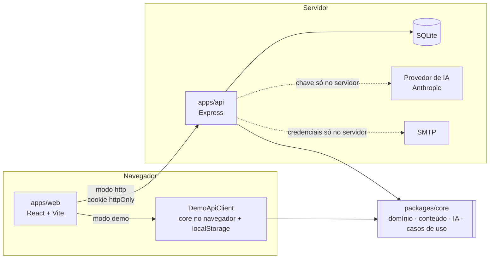

# English AI

**Plataforma de aprendizado de inglês com inteligência artificial** — aulas curtas, conversa com uma IA e
correções que explicam o porquê, com explicações em português quando você precisa.

> **Projeto acadêmico — MVP em desenvolvimento.**

| Página pública (celular) | Início (celular) | Conversa (desktop) |
| --- | --- | --- |
|  |  |  |

---

## Sumário

- [Visão geral](#visão-geral) · [Problema](#problema) · [Solução](#solução) · [Funcionalidades](#funcionalidades)
- [Landing pública](#landing-pública) · [Modo Aprender](#modo-aprender) · [Modo Conversação](#modo-conversação)
- [Arquitetura](#arquitetura) · [Estrutura do repositório](#estrutura-do-repositório) · [Stack](#stack)
- [Cadastro](#cadastro) · [Login](#login) · [Sessão](#sessão) · [Recuperação de senha](#recuperação-de-senha) · [Sistema de e-mails](#sistema-de-e-mails)
- [Modo demonstração](#modo-demonstração) · [Inteligência artificial](#inteligência-artificial) · [Segurança](#segurança) · [Privacidade](#privacidade)
- [Configuração](#configuração) · [Variáveis de ambiente](#variáveis-de-ambiente) · [Banco de dados](#banco-de-dados)
- [Instalação](#instalação) · [Execução](#execução) · [Testes](#testes) · [E2E](#e2e) · [Build](#build)
- [Documentação](#documentação) · [Limitações conhecidas](#limitações-conhecidas) · [Roadmap](#roadmap)

## Visão geral

Um **Modo Aprender** para estudar com estrutura e um **Modo Conversação** para praticar sem medo de errar, no mesmo
lugar. A IA é uma **ferramenta pedagógica**, não apenas um chatbot: explica, adapta a explicação ao nível, corrige
mostrando o porquê e acompanha o progresso. Foco inicial no celular.

O escopo, as decisões e o que ficou fora do MVP estão em [docs/MVP-SCOPE.md](docs/MVP-SCOPE.md).

## Problema

Quem começa a estudar inglês — principalmente brasileiros — não sabe por onde começar, tem pouca prática de
conversação, tem receio de errar, recebe explicações que não combinam com o próprio nível, encontra conteúdos
espalhados e pouco personalizados e tem dificuldade de manter uma rotina.

## Solução

Uma plataforma que combina **ensino estruturado, IA, conversação e acompanhamento de progresso**: um nivelamento
estima o nível, a trilha indica a próxima aula, a conversa com a IA dá prática sem constrangimento, os erros viram
revisões e a tela de Progresso mostra a evolução.

## Funcionalidades

| Área | O que a pessoa pode fazer |
| --- | --- |
| Página pública | conhecer o produto (como funciona, modos, IA, progresso, segurança), criar conta, entrar ou explorar a demonstração |
| Conta | criar conta, entrar, sair, **recuperar a senha por e-mail**, excluir conta e dados; e-mail de boas-vindas |
| Configuração inicial | informar objetivo, como avalia o próprio inglês, experiência anterior e interesses |
| Nivelamento | teste adaptativo em etapas com resultado como **nível estimado** (Iniciante, Básico, Intermediário, Avançado); pode pular |
| Início | "Continuar de onde parei", revisões pendentes, meta do dia, sequência de estudos, palavras recentes |
| Modo Aprender | 12 aulas próprias em trilha por nível, explicação, "Explicar de outro jeito", exemplos, vocabulário e 65 exercícios com feedback imediato |
| Modo Conversação | 8 assuntos (com recomendações pelo perfil), conversa com contexto, correções discretas e feedback ao final |
| Revisão | fila com o motivo de cada item (erros, nota baixa, repetição espaçada, conversa, palavras) |
| Vocabulário | palavras estudadas com tradução, exemplos, busca e filtros |
| Progresso | nível estimado, aulas, exercícios, taxa de acertos, tempo, sequência, últimos 7 dias, desempenho por tema e erros recorrentes |
| Preferências | idioma das explicações, intensidade das correções, tamanho das respostas, tradução, meta diária, histórico de conversas |
| Privacidade | ver dados coletados e finalidade, apagar conversas, desativar histórico, excluir conta |

## Landing pública

`/` é a página pública do produto, na mesma identidade visual do app. Seções: **hero** · **problema** · **como
funciona** (5 passos) · **Modo Aprender** · **Modo Conversação** · **IA** · **progresso** · **personalização** ·
**privacidade e segurança** · **chamada final** · **rodapé** (com "Sobre o projeto" e o que ainda não faz parte do
produto).

- Cabeçalho fixo com navegação por âncoras (`#como-funciona`, `#aprender`, `#conversar`, `#ia`, `#progresso`,
  `#seguranca`); em telas menores, menu acessível. A rolagem é suave só para quem não pediu movimento reduzido, e
  o foco vai para o título da seção.
- **Conteúdo honesto:** os números (aulas, exercícios, temas) vêm do próprio conteúdo do core, as correções de
  exemplo são geradas pelo verificador gramatical do projeto e a prévia do Progresso é marcada como ilustrativa.
  Sem depoimentos, números de usuários ou promessas.
- Ações de demonstração só aparecem no modo demonstração. Com sessão ativa, `/` leva à etapa pendente (ou ao
  Início).

Detalhes: [docs/UX-SPECIFICATION.md](docs/UX-SPECIFICATION.md) e
[design/SCREEN-SPECIFICATIONS.md](design/SCREEN-SPECIFICATIONS.md).

## Modo Aprender

Ensino estruturado: **aula → explicação → exemplos → vocabulário → exercícios → correção → resumo → revisão**.
Os exercícios fechados são corrigidos por gabarito; a escrita livre é analisada por regras gramaticais e pela IA.
Todo erro mostra o formato pedagógico:

> **Sua frase:** She ~~go~~ to school every day.
> **Forma recomendada:** She **goes** to school every day.
> **Explicação:** Com "he", "she" e "it", normalmente adicionamos "-s" ao verbo no presente simples.

## Modo Conversação

Prática natural com a **Lumi**, a parceira de conversa. Princípio: **NATURALIDADE > CORREÇÃO EXCESSIVA**.
A Lumi reage ao que você disse, faz uma pergunta por vez, lembra o que você contou e reformula seus erros dentro da
própria resposta. Quando uma correção aparece, ela é discreta e opcional:

> **You said:** I have 25 years. · **More natural:** I am 25 years old. · *Por quê?*

Ao encerrar, o resumo reúne os pontos para praticar, sugere aulas e cria revisões.

## Arquitetura



- **`packages/core`** — regras de negócio, conteúdo pedagógico, camada de IA e casos de uso (UC01–UC12, incluindo a
  recuperação de senha), sem depender de framework, banco ou provedor (portas e adaptadores).
- **`apps/api`** — API HTTP que implementa as portas com SQLite, autenticação segura, envio de e-mails e o provedor
  real de IA.
- **`apps/web`** — interface mobile first. Funciona em dois modos: **demo** (roda o core no navegador, sem
  backend) e **http** (usa a API).

Documento completo: [docs/ARCHITECTURE.md](docs/ARCHITECTURE.md).

## Estrutura do repositório

```text
.
├── apps/
│   ├── api/                API HTTP (Express + SQLite)
│   │   └── src/
│   │       ├── config/     configuração validada (env.ts)
│   │       ├── db/         esquema SQLite e migrações aditivas
│   │       ├── email/      EmailService, mailers (SMTP, caixa de saída, memória) e templates
│   │       ├── http/       app Express, middlewares e rotas (auth, password, learning, conversation)
│   │       ├── repositories/ implementação SQLite das portas do core
│   │       └── security/   hash de senha e tokens de sessão
│   └── web/                aplicação web mobile first
│       └── src/
│           ├── app/        rotas, guardas, sessão e cache
│           ├── features/   landing, auth, onboarding, placement, learning, conversation, …
│           ├── components/ design system em componentes
│           └── services/   cliente demo (core no navegador) e cliente http
├── packages/
│   └── core/               domínio, conteúdo, IA e casos de uso compartilhados
├── e2e/                    testes de ponta a ponta (Playwright) nos modos demonstração e http
├── docs/                   arquitetura, autenticação e e-mail, IA, fluxos, escopo, UX, modelo de dados, rastreabilidade
├── design/                 design system, componentes, telas, guia do Figma, capturas
├── .env.example            variáveis de ambiente (sem segredos)
└── package.json            scripts do monorepo
```

## Stack

| Camada | Tecnologias |
| --- | --- |
| Linguagem | TypeScript (modo estrito), Node.js ≥ 22.13 |
| Web | React 19, Vite, React Router, TanStack Query, CSS Modules, Lucide (ícones), fontes Fraunces e Atkinson Hyperlegible Next |
| API | Express 5, `node:sqlite`, zod, helmet, express-rate-limit, JSON Web Token em cookie httpOnly, scrypt, nodemailer |
| IA | SDK oficial da Anthropic (opcional), modo demonstração próprio |
| Testes | Vitest, Testing Library, jsdom, Supertest, Playwright (ponta a ponta) |
| Monorepo | npm workspaces |

## Cadastro

Nome, e-mail, senha (8+ caracteres, com letra e número, requisitos mostrados ao vivo), confirmação e aceite dos
termos. A senha vira hash **scrypt**; a conta começa a sessão na hora e segue para a configuração inicial e o
nivelamento. No modo http, um **e-mail de boas-vindas** é enviado em segundo plano — se o envio falhar, a conta
continua válida.

## Login

E-mail e senha, com mensagem genérica para credenciais erradas ("E-mail ou senha incorretos") e tempo de resposta
equalizado. Depois de entrar, a pessoa volta à página que tentou abrir (só caminhos internos). Limite de 20
tentativas por IP a cada 15 minutos.

## Sessão

- **Cookie httpOnly, SameSite=Strict** (Secure em produção) com um JWT que o JavaScript da página não lê; nada de
  token no `localStorage`.
- O token carrega a **versão da sessão** da conta: redefinir a senha encerra todas as sessões abertas, em qualquer
  aparelho.
- Cada tela autenticada envia o id da conta exibida (`X-Session-User`): se o cookie for de outra conta (login em
  outra aba), a API responde 401 em vez de misturar dados.
- Ao sair, expirar ou excluir a conta, o app cancela as requisições privadas, apaga da memória os dados da conta e
  avisa as outras abas (`BroadcastChannel`). Detalhes em [docs/ARCHITECTURE.md §6.1](docs/ARCHITECTURE.md).

## Recuperação de senha

```text
/recuperar-senha → e-mail → resposta sempre igual → (se a conta existir) link por e-mail
→ /redefinir-senha/:token → senha nova (mesma política do cadastro) → link consumido → sessões antigas encerradas → Entrar
```

- Token aleatório de 256 bits; o banco guarda **só o hash SHA-256**.
- Vale **15 minutos** (configurável), funciona **uma única vez**, e um novo pedido invalida o link anterior.
- A resposta não revela se o e-mail tem conta; pedidos de e-mail têm limite por IP e por conta.
- A tela mostra o estado do link: válido, inválido, vencido, já usado, falha ao verificar e sucesso.

Fluxo completo e decisões: [docs/EMAIL-AND-AUTH.md](docs/EMAIL-AND-AUTH.md).

## Sistema de e-mails

As rotas nunca falam com SMTP: chamam o `EmailService` (`apps/api/src/email/`), que monta a mensagem a partir de um
template (layout base com a identidade do English AI, HTML compatível com clientes de e-mail e versão em texto) e
entrega a um `Mailer`:

| Transporte | Uso |
| --- | --- |
| **SMTP** (nodemailer) | produção — envio real, STARTTLS obrigatório, credenciais só no `.env` do servidor |
| **Caixa de saída local** | desenvolvimento — cada e-mail vira `.html` e `.json` em `data/outbox/`; abra o `.html` e clique no link |
| **Memória** | testes — nada sai do processo |
| **Desativado** | produção sem SMTP — nada é enviado, com aviso na inicialização |

O envio é em segundo plano e à prova de falhas: um erro de SMTP fica no log (só com o código do erro) e nunca
desfaz o cadastro nem altera a resposta da recuperação de senha.

## Modo demonstração

É o padrão de `npm run dev`. Sem backend nem chave de API:

- os dados ficam no `localStorage` deste navegador e as respostas da IA têm um pequeno atraso simulado;
- **"Explorar demonstração com dados de exemplo"** entra como **Alex** (objetivo Conversar, nível Básico, com
  histórico de estudos) — conta `alex@demo.englishai.app` / `demo1234`;
- a IA de demonstração conversa seguindo roteiros por assunto, lembra fatos e não repete perguntas, reformula erros
  comuns de brasileiros (25 regras, como *I have 25 years*, *She go*, *at the morning*) e explica em português ou
  inglês conforme o nível;
- **nenhum e-mail é enviado**: a recuperação de senha mostra uma simulação identificada do e-mail que seria
  enviado, com o link para continuar o fluxo.

## Inteligência artificial

- **Uma interface, vários provedores.** A aplicação depende só de `AIService`. Há duas implementações: o **modo
  demonstração** (sem chave, sem custo) e um serviço para modelos de linguagem reais com **fallback automático**.
- **A aplicação decide, a IA ajuda.** O que corrigir e quando mostrar fica em código (`correctionPolicy.ts`); trechos
  apontados pelo modelo só são aceitos se existirem na mensagem.
- **Adaptação por nível** (`levelPolicy.ts`) e **intensidade das correções** escolhida pela pessoa (Leve,
  Equilibrada, Detalhada).
- Para usar o provedor real: `AI_PROVIDER=anthropic` e `ANTHROPIC_API_KEY` no `.env`, e `npm run dev:full`.

> A integração real está implementada e testada com um provedor simulado, mas **não foi executada contra a API
> real** neste desenvolvimento (não havia chave configurada).

Detalhes: [docs/IA-BEHAVIOR.md](docs/IA-BEHAVIOR.md) e [docs/AI-PROMPT-STRATEGY.md](docs/AI-PROMPT-STRATEGY.md).

## Segurança

- Senhas com **scrypt** e salt; sessão em cookie httpOnly/SameSite=Strict; proteção CSRF por cabeçalho.
- **helmet**, CORS restrito, **limites de requisição** (cadastro/login, pedidos de e-mail, IA), validação com
  **zod**, corpo limitado a 16 KB.
- Cada recurso é verificado contra o dono (conversas de outra pessoa respondem 404).
- Recuperação de senha com token de uso único guardado como hash, validade curta e encerramento das sessões.
- Links dos e-mails montados com `APP_PUBLIC_URL`, nunca com o cabeçalho `Host` da requisição.
- Logs sem e-mail, senha, token, link de redefinição ou conteúdo de mensagens.
- **Chaves e credenciais só no `.env` do servidor**; nada de segredo no código, no front-end ou no repositório.

## Privacidade

LGPD como referência: coleta mínima, finalidade explicada na tela "Privacidade e dados", o que vai para a IA
(primeiro nome e dados de aprendizagem; e-mails, telefones, CPF e cartões digitados são removidos), histórico de
conversas opcional com retenção de 90 dias, exclusão da conta com todos os dados (inclusive pedidos de
redefinição de senha) e limpeza periódica de dados vencidos.

## Configuração

Copie `.env.example` para `.env` na raiz (opcional em desenvolvimento). **Nunca faça commit do `.env`** (já está no
`.gitignore`). A API valida a configuração ao iniciar e recusa combinações inseguras (ex.: sem `AUTH_TOKEN_SECRET`
em produção, caixa de saída local de e-mails em produção, SMTP sem `APP_PUBLIC_URL`/`MAIL_FROM` em produção).
Só variáveis com prefixo `VITE_` chegam ao navegador — nunca coloque segredos nelas.

## Variáveis de ambiente

| Variável | Padrão | Descrição |
| --- | --- | --- |
| `NODE_ENV` | `development` | `production` exige `AUTH_TOKEN_SECRET` |
| `API_PORT` | `3333` | porta da API |
| `CORS_ORIGIN` | `http://localhost:5173` | origem permitida para o front-end |
| `AUTH_TOKEN_SECRET` | — | segredo da sessão; em desenvolvimento, se vazio, é gerado a cada início |
| `AUTH_TOKEN_TTL_HOURS` | `72` | duração da sessão |
| `DATABASE_PATH` | `./data/english-ai.db` | arquivo SQLite (relativo a `apps/api`) |
| `CONVERSATION_RETENTION_DAYS` | `90` | dias até apagar conversas salvas |
| `WEB_DIST_PATH` | — | build da web para a API servir (opcional) |
| `MAIL_TRANSPORT` | automático | `smtp`, `outbox` ou `disabled` (ver [Sistema de e-mails](#sistema-de-e-mails)) |
| `SMTP_HOST` / `SMTP_PORT` / `SMTP_SECURE` | — / `587` / `false` | servidor SMTP (preenchido = envio real) |
| `SMTP_USER` / `SMTP_PASSWORD` | — | credenciais SMTP (somente no servidor) |
| `MAIL_FROM` | remetente de desenvolvimento | remetente; obrigatório em produção com SMTP |
| `APP_PUBLIC_URL` | primeira origem de `CORS_ORIGIN` | endereço público usado nos links dos e-mails; obrigatório em produção com SMTP |
| `MAIL_OUTBOX_DIR` | `./data/outbox` | caixa de saída local (desenvolvimento) |
| `PASSWORD_RESET_TTL_MINUTES` | `15` | validade do link de redefinição (5 a 120) |
| `AI_PROVIDER` | `mock` | `mock` ou `anthropic` |
| `ANTHROPIC_API_KEY` | — | chave do provedor (somente no servidor) |
| `ANTHROPIC_MODEL` | `claude-opus-5-5` | modelo usado com `AI_PROVIDER=anthropic` |
| `AI_EFFORT` | `low` | esforço de raciocínio: `low`, `medium` ou `high` |
| `AI_MAX_HISTORY_MESSAGES` | `12` | mensagens anteriores enviadas ao modelo |
| `AI_TIMEOUT_MS` | `20000` | tempo máximo por chamada de IA |
| `VITE_API_MODE` | `demo` | `demo` (sem backend) ou `http` |
| `VITE_API_BASE_URL` | `/api` | endereço da API no modo http |

## Banco de dados

SQLite (`node:sqlite`), criado automaticamente em `apps/api/data/` (fora do Git). O esquema
(`apps/api/src/db/schema.sql`) é idempotente e roda a cada inicialização; mudanças em bancos existentes são
**migrações aditivas** em `apps/api/src/db/database.ts`, que nunca apagam dados (ex.: a coluna
`users.session_version`). Tabelas de autenticação: `users` (com `password_hash` e `session_version`) e
`password_reset_tokens` (`token_hash` único, `expires_at`, `used_at`, `created_at`, removida em cascata com a conta).
DER e diagrama de classes: [docs/DATABASE-MODEL.md](docs/DATABASE-MODEL.md).

## Instalação

Pré-requisitos: **Node.js 22.13 ou superior** (há um `.nvmrc`) e npm.

```bash
git clone https://github.com/Helio965/language-tool.git
cd language-tool
npm ci
```

## Execução

### Protótipo navegável (recomendado para avaliar)

```bash
npm run dev
```

Abra <http://localhost:5173>. Na página pública, use **"Explorar demonstração com dados de exemplo"** ou crie uma
conta nova para o fluxo completo (cadastro → configuração → nivelamento → aulas → conversa).

### Aplicação completa (web + API + SQLite)

```bash
cp .env.example .env      # opcional em desenvolvimento
npm run dev:full
```

Sobe a API em <http://localhost:3333> e a web em <http://localhost:5173> (modo `http`, com proxy para `/api`).
Sem SMTP configurado, os e-mails (boas-vindas e recuperação de senha) vão para `apps/api/data/outbox/`: abra o
`.html` no navegador para clicar no link.

### Scripts

| Comando | O que faz |
| --- | --- |
| `npm run dev` | web em modo demonstração |
| `npm run dev:api` | só a API (com recarga) |
| `npm run dev:full` | API + web em modo http |
| `npm run build` | typecheck e build de tudo |
| `npm test` | testes de todos os pacotes |
| `npm run test:e2e` | testes de ponta a ponta no navegador (Playwright) |
| `npm run typecheck` | verificação de tipos (pacotes e `e2e/`) |

## Testes

```bash
npm test
```

| Pacote | Testes | Cobertura principal |
| --- | --- | --- |
| `packages/core` | 163 | conteúdo, correção de exercícios, regras gramaticais, política de correção, nivelamento, progresso, revisão, privacidade, IA (mock, prompts, validação, fallback), armazenamento consistente entre abas, recuperação de senha (token, hash, validade, uso único, invalidação, política de senha, versão da sessão) e a jornada completa |
| `apps/api` | 60 | cabeçalhos de segurança, CSRF, autenticação, conta exibida × cookie (`X-Session-User`), rate limit, logs sem dados sensíveis, isolamento entre usuários, exclusão de dados, jornada pela API, fallback da SPA, migração do banco, recuperação de senha de ponta a ponta, encerramento de sessões, e-mails (templates, envio, falhas de SMTP, configuração) |
| `apps/web` | 53 | cadastro, login, rotas protegidas, exercícios, cartão de correção, conversa, regressão de sessão (sair, expirar, trocar de conta, excluir, recarregar, erro de rede, preferências), telas de recuperação e redefinição de senha e página pública (seções, navegação, menu, CTAs, honestidade do conteúdo) |

Nenhum teste usa SMTP de verdade: os e-mails vão para um mailer em memória (ou para a caixa de saída local nos
testes E2E).

## E2E

```bash
npx playwright install chromium   # uma vez, se o Chromium do Playwright ainda não estiver instalado
npm run test:e2e
```

16 testes no Chromium, em dois projetos que sobem os próprios servidores:

- **demo** (Vite, dados no navegador): navegação e saída da conta, seleção de texto, sessão expirada com retorno à
  página, saída em outra aba, login incorreto/correto, ausência de rolagem horizontal em 320px, página pública no
  celular (menu, âncoras, foco) e recuperação de senha simulada.
- **http** (API + SQLite temporário + build da web, e-mails na caixa de saída local): cadastro completo e cookie
  httpOnly sem token no `localStorage`, nenhuma requisição privada depois de sair, troca de conta sem vazamento,
  sessão expirada, exclusão da conta, página pública → cadastro → Início (com e-mail de boas-vindas) e recuperação
  de senha real (link lido da caixa de saída, sessão do outro aparelho encerrada, senha antiga recusada, link de uso
  único, e-mail sem conta não gera mensagem).

Os testes também conferem o console do navegador: qualquer erro faz o teste falhar (as únicas exceções aceitas são
respostas 401 esperadas — sessão expirada, login recusado).

## Build

```bash
npm run build             # typecheck + build da API + build da web
npm run start:api         # API compilada (produção exige AUTH_TOKEN_SECRET; e-mails exigem SMTP, APP_PUBLIC_URL e MAIL_FROM)
npm run preview           # pré-visualiza o build da web
```

Para a API servir também a interface, gere a web no modo http (`npm run build -w @english-ai/web -- --mode http`)
e defina `WEB_DIST_PATH=../web/dist` no `.env`.

## Documentação

| Documento | Conteúdo |
| --- | --- |
| [docs/MVP-SCOPE.md](docs/MVP-SCOPE.md) | análise dos materiais, escopo, divergências e decisões |
| [docs/ARCHITECTURE.md](docs/ARCHITECTURE.md) | arquitetura, segurança, privacidade, decisões e evolução |
| [docs/EMAIL-AND-AUTH.md](docs/EMAIL-AND-AUTH.md) | cadastro, login, sessão, recuperação de senha e sistema de e-mails |
| [docs/DATABASE-MODEL.md](docs/DATABASE-MODEL.md) | DER e diagrama de classes |
| [docs/USER-FLOWS.md](docs/USER-FLOWS.md) | fluxos de usuário |
| [docs/UX-SPECIFICATION.md](docs/UX-SPECIFICATION.md) | princípios, estados, acessibilidade, página pública e visualização do progresso |
| [docs/IA-BEHAVIOR.md](docs/IA-BEHAVIOR.md) | comportamento da IA (personalidade, modos, correções, níveis) |
| [docs/AI-PROMPT-STRATEGY.md](docs/AI-PROMPT-STRATEGY.md) | prompts em camadas, esquemas e validação |
| [docs/REQUIREMENTS-TRACEABILITY.md](docs/REQUIREMENTS-TRACEABILITY.md) | auditoria RF/RNF/RN/UC, tarefas e lacunas |
| [design/DESIGN-SYSTEM.md](design/DESIGN-SYSTEM.md) | identidade visual e tokens |
| [design/COMPONENTS.md](design/COMPONENTS.md) | componentes |
| [design/SCREEN-SPECIFICATIONS.md](design/SCREEN-SPECIFICATIONS.md) | especificação tela a tela |
| [design/FIGMA-GUIDE.md](design/FIGMA-GUIDE.md) | como reproduzir no Figma (não há arquivo Figma criado) |

## Limitações conhecidas

- Protótipo no Figma não criado (o guia explica como montá-lo).
- Envio real por SMTP não foi executado contra um servidor de e-mail de verdade neste ambiente (testado com o
  transporte do nodemailer em memória e com a caixa de saída local).
- Sem confirmação de e-mail no cadastro; envio sem fila nem nova tentativa automática.
- Sair da conta remove o cookie, mas não revoga o token no servidor (ele vale até vencer ou até a senha mudar).
- Lembretes de estudo são salvos, mas não enviados.
- Modo demonstração da IA segue roteiros: conversas livres e erros fora das 25 regras dependem do provedor real.
- Sem voz, pronúncia ou áudio (fora do escopo do MVP); sem telas de administração de conteúdo.
- SQLite e limites de requisição em memória atendem a uma instância; para várias, trocar adaptadores.
- Testado no Chromium (celular, tablet e desktop emulados); sem auditoria automática de acessibilidade (axe) nem
  leitor de tela real.
- O JavaScript da web sai em um único arquivo (~219 KB com gzip); dividir por rota fica para a evolução.
- Modo demonstração: o aviso "Sua sessão expirou" só aparece enquanto a página continua aberta.

Lista completa: [docs/REQUIREMENTS-TRACEABILITY.md §9](docs/REQUIREMENTS-TRACEABILITY.md#9-lacunas-e-limitações-conhecidas-sem-esconder).

## Roadmap

Baseado na Análise de requisitos (§25):

1. **Planejamento** — análise, arquitetura, MVP, protótipo, modelagem ✅
2. **MVP** — autenticação, perfil, nivelamento, Modo Aprender, Modo Conversação, integração com IA, progresso ✅
   - página pública, e-mails transacionais e recuperação de senha real ✅
3. **Aprimoramento** — revisão automática mais inteligente, vocabulário personalizado, exercícios adaptativos,
   gamificação leve, personalização mais fina, confirmação de e-mail e lembretes por e-mail
4. **Recursos avançados** — conversa por voz, pronúncia, listening, outras personalidades
5. **Inglês profissional** — entrevistas, reuniões, apresentações, inglês para tecnologia, vocabulário técnico

Continuam fora do escopo atual: voz, reconhecimento de pronúncia, chamadas, gamificação avançada, ranking,
certificação oficial e marketplace.

## Licença

[MIT](LICENSE). O conteúdo pedagógico foi escrito para este projeto; as fontes são distribuídas sob a SIL Open
Font License.
