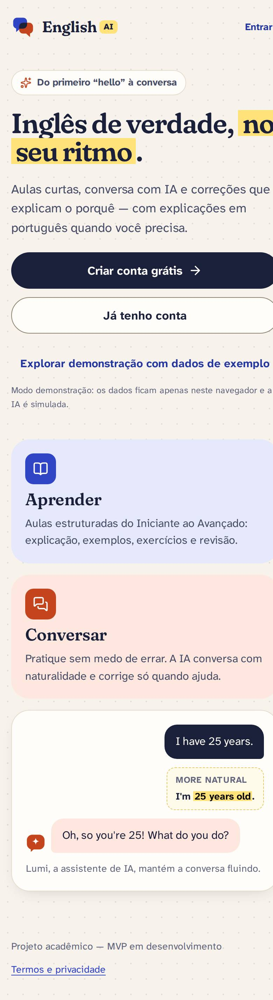

# Especificação de telas — English AI

> Tela a tela do protótipo navegável (`apps/web`). Para cada tela: objetivo, requisitos atendidos, conteúdo
> na ordem de leitura do celular, ação principal, estados e diferenças em telas maiores.
> As imagens em [`screenshots/`](./screenshots) foram capturadas do protótipo em execução (modo
> demonstração) — **não são telas do Figma**. Fluxos completos: [USER-FLOWS.md](../docs/USER-FLOWS.md).

Larguras de captura: celular 390px · tablet 820px · desktop 1440px.

---

## Públicas

### 1. Boas-vindas — `/`

- **Objetivo:** explicar a proposta em segundos e levar ao cadastro.
- **Conteúdo:** marca → título "Inglês de verdade, no seu ritmo." (com marca-texto) → subtítulo → **Criar conta
  grátis** · "Já tenho conta" → "Explorar demonstração com dados de exemplo" (só no modo demo, com aviso de que
  os dados ficam no navegador) → prévia dos dois modos (Aprender / Conversar) com exemplo de conversa corrigida.
- **Desktop:** duas colunas (texto + prévia). [desktop-01](./screenshots/desktop-01-boas-vindas.jpg)

### 2. Criar conta — `/cadastro` (UC01, RF01)

- **Campos:** Nome, E-mail, Senha (requisitos ao vivo: pelo menos 8 caracteres, uma letra e um número), Confirme a senha,
  aceite dos termos (obrigatório, com link).
- **Ação:** **Criar conta** → configuração inicial.
- **Estados:** erros por campo ao sair do campo/enviar; foco no primeiro erro; e-mail já cadastrado com atalho
  "Entrar com este e-mail"; botão em carregamento "Criando sua conta…".

### 3. Entrar — `/entrar` (UC02, RF02) e Recuperar senha — `/recuperar-senha`

- E-mail + senha; erro genérico "E-mail ou senha incorretos" (não revela se a conta existe); senha limpa após
  erro; volta para a página que a pessoa tentou abrir.
- Cartão com a conta de demonstração (modo demo).
- Recuperação: mensagem neutra "Se existir uma conta com este e-mail…" (envio simulado no MVP).

### 4. Termos e privacidade — `/termos-e-privacidade`

Termos de uso do protótipo + tabela "dado / para quê / por quanto tempo" (mesma da página Privacidade).

## Primeiro acesso

### 5. Configuração inicial — `/configuracao` (UC03, RF03, RF04)

- **Três etapas com barra de progresso:** (1) objetivo principal; (2) como descreve o próprio inglês +
  experiência anterior; (3) interesses (conversação, profissional, áreas como Viagens, Tecnologia, Comida).
- **Ação:** **Continuar** / **Salvar e fazer o nivelamento**. "Voltar" preserva as respostas.
- Reaproveitada em `/perfil/editar` (modo edição, tela imersiva).

### 6. Nivelamento — `/nivelamento` (UC04, RF05, RN01)

| Pergunta | Resultado |
| --- | --- |
|  |  |

- **Introdução:** quantas perguntas, tempo estimado e que o resultado é uma estimativa; opção **Prefiro começar do zero**
  (começa como Iniciante).
- **Perguntas:** etapas progressivas (Iniciante → Básico → Intermediário); avança de etapa com 3 de 4 acertos.
- **Resultado:** "Seu nível estimado" + comparação com a autoavaliação + aviso de que não é certificação.
- **Ação:** **Ir para o início**. Refazer pelo perfil (`/perfil/nivelamento`).

## App

### 7. Início — `/inicio` (RF06, RF15)

| Celular | Tablet | Desktop |
| --- | --- | --- |
|  |  |  |

- **Conteúdo:** nível estimado + objetivo → saudação → **Continuar de onde parei** (próxima aula, ação
  principal) → revisões pendentes (total + motivo da primeira) → escolha do modo (Aprender / Conversar) → meta de
  hoje (anel) e sequência → resumo do progresso → palavras recentes → última conversa.
- **Estados:** usuário novo (primeira aula em destaque, sem cartões vazios); todas as aulas concluídas.
- **Desktop:** coluna lateral "Resumo do dia" com meta, progresso e palavras.

### 8. Aprender — `/aprender` (UC05, RF07)

Trilha por nível (Iniciante → Avançado) com estado de cada aula (concluída com nota, em andamento, próxima,
disponível) e nota para níveis acima do estimado ("Recomendado depois de avançar…", sem bloquear).

### 9. Aula — `/aprender/aula/:id` (UC05, UC06, UC07, RF07–RF10) — imersiva

| Explicação | Feedback de exercício | Correção de escrita |
| --- | --- | --- |
|  |  |  |

- **Etapas:** apresentação (objetivos, tempo, nº de exercícios) → explicação (com **Explicar de outro jeito**) →
  exemplos (com **Me dê outro exemplo**) → vocabulário → exercícios → resumo.
- **Barra de foco:** sair, título e progresso da aula.
- **Resumo:** acertos (anel), tempo, palavras novas, **Praticar isso na conversa**, revisão sugerida se a nota
  for baixa, próxima aula.
- **Desktop:** sumário fixo das etapas à esquerda. [desktop-03](./screenshots/desktop-03-aula.jpg)

### 10. Conversar — `/conversar` (UC09, RF11, RF12)

- Atalhos para as preferências (intensidade de correção, histórico) → assuntos com até 3 marcados
  "Para você" (interesses do perfil) e aviso quando acima do nível → conversas recentes (se o histórico estiver
  ativo) ou aviso de histórico desativado.

### 11. Conversa — `/conversar/:id` (UC09, RF11–RF14, RN04) — imersiva

| Celular | Desktop |
| --- | --- |
|  |  |

- **Barra de foco:** voltar, "Lumi · assunto", **Encerrar** (após a primeira mensagem).
- **Mensagens:** Lumi à esquerda (balão coral claro, "Ver tradução" nos níveis iniciais); usuário à direita
  (balão tinta); correção discreta abaixo da mensagem do usuário ("You said / More natural / Por quê?");
  avisos de privacidade quando algo é removido.
- **Composer:** área de texto que cresce, Enter envia, contador perto do limite; rodapé "Lumi é uma IA e pode
  errar…".
- **Estados:** IA preparando resposta (balão com três pontos), erro ao enviar (texto volta ao campo),
  conversa encerrada.
- **Encerrar:** diálogo de confirmação (avisa se o conteúdo será apagado).
- **Desktop:** painel "Feedback da conversa" com contadores (mensagens, correções mostradas, guardadas para o
  final) e explicação da intensidade.

### 12. Feedback da conversa (após encerrar)

Título ("Boa conversa! Veja o que praticar" ou "Conversa impecável!") → mensagens, mensagens sem ajuste, duração
→ aviso se o conteúdo foi apagado → **Pontos para praticar** (CorrectionCard completo) → **Aulas que ajudam** →
**Nova conversa** / **Ver meu progresso**.

### 13. Progresso — `/progresso` (UC11, RF15, RF16)

| Celular | Desktop |
| --- | --- |
|  |  |

Especificação da visualização: [UX-SPECIFICATION.md §7](../docs/UX-SPECIFICATION.md#7-visualização-do-progresso).
Tablet: [tablet-03](./screenshots/tablet-03-progresso.jpg).

### 14. Revisão — `/revisao` e `/revisao/:id` (UC08, RF17)

- Fila com o **motivo** de cada item (erros, nota baixa, intervalo de repetição, conversa, palavras prontas
  para revisar) e quando foi agendado.
- Sessão de revisão usa o mesmo `ExerciseRunner`; ao final mostra a nota e a próxima data (intervalos de
  1, 3, 7, 14 e 30 dias).

### 15. Vocabulário — `/vocabulario` (RF18)

Busca, filtros (Todas, Para revisar, Aprendidas), lista com palavra + tradução + estado; diálogo com
significado, exemplos, link para a aula e as ações "Quero revisar de novo" / "Já aprendi". Link direto: `/vocabulario?palavra=<id>`.

### 16. Perfil — `/perfil` (UC10, RF19)

Nome, e-mail, nível estimado, objetivo e interesses → **Editar** · **Refazer** nivelamento → atalhos
(Progresso, Vocabulário, Revisão, Preferências, Privacidade, Refazer nivelamento) → **Sair da conta**.

### 17. Preferências — `/preferencias` (UC12)

Idioma das explicações · intensidade das correções (com pré-visualização ao vivo do CorrectionCard) · tamanho
das respostas · tradução de apoio · meta diária · lembretes (salvos, envio fora do MVP) · salvar histórico de
conversas. Cada alteração salva na hora com toast.

### 18. Privacidade e dados — `/privacidade` (RF20, RNF05)

Tabela de dados coletados (empilhada no celular) → o que vai para a IA → direitos → **Apagar todas as
conversas** → **Excluir minha conta** (diálogo com senha).

### 19. Página não encontrada — `*`

Mensagem amigável e botão para o Início (ou boas-vindas, sem sessão).
