# Especificação de telas — English AI

> Tela a tela do protótipo navegável (`apps/web`). Para cada tela: objetivo, requisitos atendidos, conteúdo
> na ordem de leitura do celular, ação principal, estados e diferenças em telas maiores.
> As imagens em [`screenshots/`](./screenshots) foram capturadas do protótipo em execução (modo
> demonstração) — **não são telas do Figma**. Fluxos completos: [USER-FLOWS.md](../docs/USER-FLOWS.md).

Larguras de captura: celular 390px · tablet 820px · desktop 1440px.

---

## Públicas

### 1. Página pública — `/`

| Celular | Desktop |
| --- | --- |
| 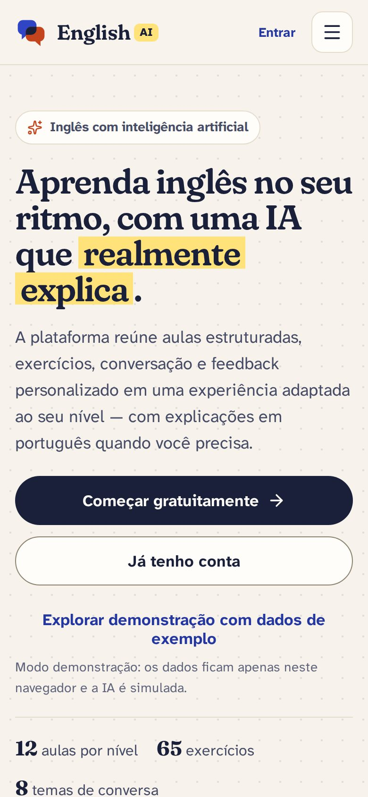 | 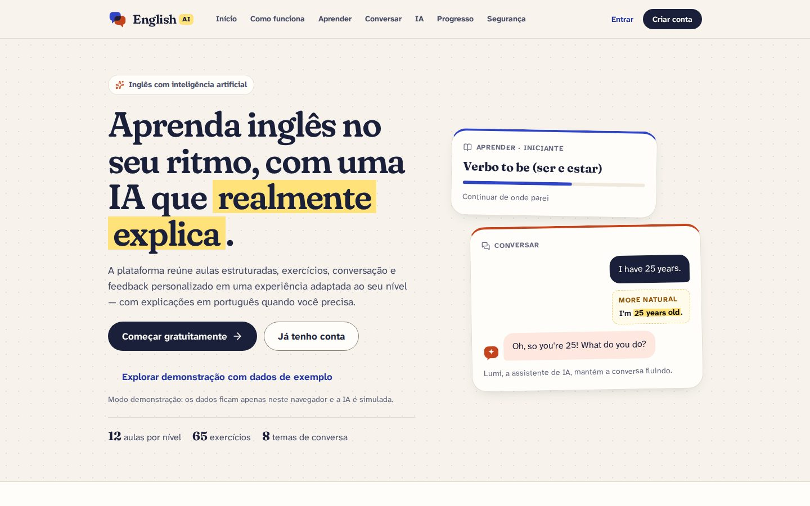 |

- **Objetivo:** apresentar o produto com clareza e levar ao cadastro, sem prometer o que não existe.
- **Cabeçalho fixo:** logo · seções (Início, Como funciona, Aprender, Conversar, IA, Progresso, Segurança) ·
  **Entrar** · **Criar conta**. Abaixo de 1100px: botão **Menu de seções**; abaixo de 600px, "Criar conta" entra no
  menu.
- **Conteúdo, na ordem:** hero (título "Aprenda inglês no seu ritmo, com uma IA que realmente explica." com
  marca-texto, **Começar gratuitamente** · **Já tenho conta** · no modo demo "Explorar demonstração com dados de
  exemplo" e o aviso de que os dados ficam no navegador, fatos do conteúdo, prévia de aula e conversa) → problema
  (7 cartões) → como funciona (5 passos) → Modo Aprender (recursos + exercício corrigido) → Modo Conversação
  (princípio "Naturalidade > correção excessiva" + conversa) → IA (capacidades + correção explicada) → progresso
  (métricas + prévia "Exemplo ilustrativo") → personalização → privacidade e segurança → chamada final (fundo
  azul-marinho, botão amarelo) → rodapé (Sobre o projeto, Produto, Conta, Informações, Legal).
- **Estados:** com sessão, a tela não aparece (vai para a etapa pendente ou para o Início); erro ao preparar a
  demonstração aparece abaixo do botão.
- **Desktop:** hero em duas colunas; seções de modo alternam texto e exemplo; grades de 4/5 colunas.
- Especificação de conteúdo e navegação: [UX-SPECIFICATION.md §3.1](../docs/UX-SPECIFICATION.md).

### 2. Criar conta — `/cadastro` (UC01, RF01)

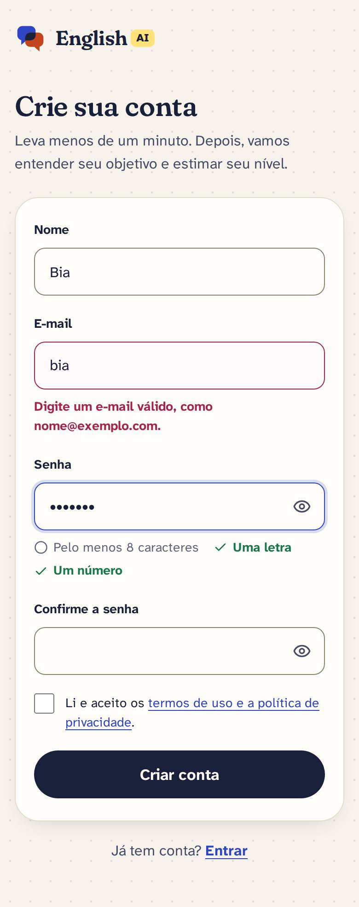

- **Campos:** Nome, E-mail, Senha (requisitos ao vivo: pelo menos 8 caracteres, uma letra e um número), Confirme a senha,
  aceite dos termos (obrigatório, com link).
- **Ação:** **Criar conta** → configuração inicial.
- **Estados:** erros por campo ao sair do campo/enviar; foco no primeiro erro; e-mail já cadastrado com atalho
  "Entrar com este e-mail"; botão em carregamento "Criando sua conta…".

### 3. Entrar — `/entrar` (UC02, RF02) e Recuperar senha — `/recuperar-senha`

- E-mail + senha; erro genérico "E-mail ou senha incorretos" (não revela se a conta existe); senha limpa após
  erro; volta para a página que a pessoa tentou abrir (só caminhos internos do app; nunca para `/entrar`,
  `/cadastro` ou `/recuperar-senha`).
- **Sessão expirada:** um único aviso informativo "Sua sessão expirou. Entre novamente para continuar." acima do
  formulário; depois do login a pessoa volta à página em que estava. Quando a pessoa **escolheu sair**, o aviso
  não aparece (só o toast "Você saiu da sua conta.").
- Botão em carregamento "Entrando…"; um segundo clique/Enter durante o envio é ignorado.
- Cartão com a conta de demonstração (modo demo).
- Link **Esqueci minha senha** → `/recuperar-senha`.

### 3.1 Recuperar senha — `/recuperar-senha` e Redefinir senha — `/redefinir-senha/:token`

| Recuperar (simulação da demonstração) | Redefinir |
| --- | --- |
| 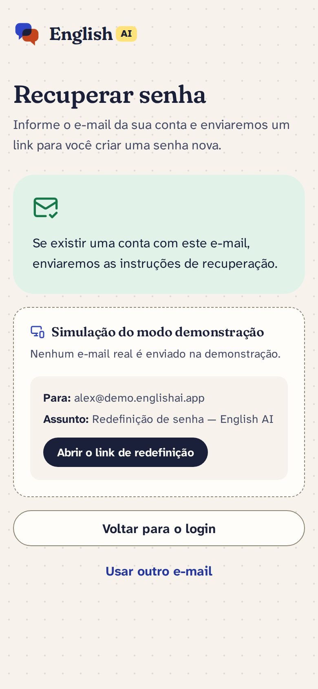 | 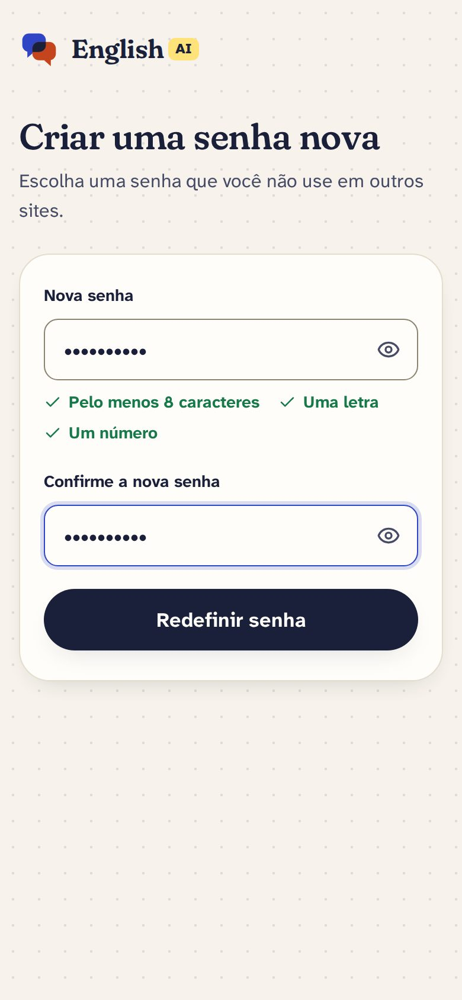 |

- **Recuperar:** campo E-mail → **Enviar link de redefinição** ("Enviando…"). Resposta sempre igual: "Se existir uma
  conta com este e-mail, enviaremos as instruções de recuperação." No modo http: "Confira a caixa de entrada e a
  pasta de spam. O link vale por 15 minutos e só pode ser usado uma vez." No modo demo: cartão tracejado
  **Simulação do modo demonstração** (nenhum e-mail real é enviado) com Para, Assunto e **Abrir o link de
  redefinição**. Ações: **Voltar para o login** · **Usar outro e-mail**.
- **Redefinir:** estados — verificando ("Verificando o link…") → **Criar uma senha nova** (Nova senha com
  requisitos ao vivo, Confirme a nova senha, **Redefinir senha** / "Salvando…") → "Senha redefinida com sucesso." +
  **Entrar**. Link indisponível: "Este link venceu", "Este link já foi usado" ou "Link inválido", com **Pedir um
  novo link** e **Voltar para o login**. Falha de conexão: "Não foi possível verificar o link" + **Tentar de
  novo**. O título recebe o foco a cada mudança de estado.

### 4. Termos e privacidade — `/termos-e-privacidade`

Termos de uso do protótipo + tabela "dado / para quê / por quanto tempo" (mesma da página Privacidade).

## Primeiro acesso

### 5. Configuração inicial — `/configuracao` (UC03, RF03, RF04)

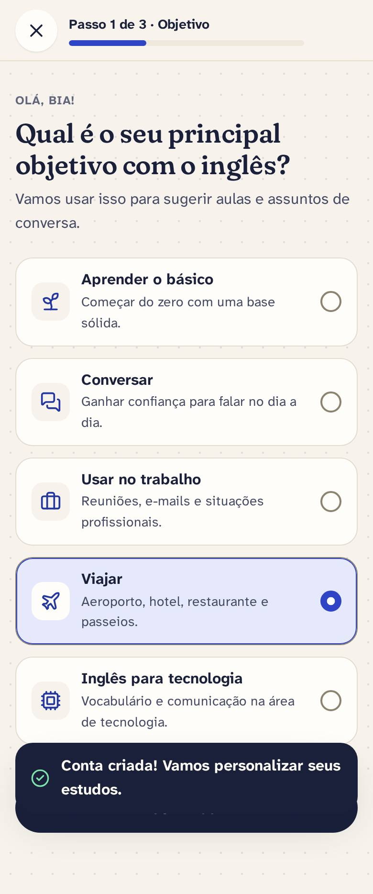

- **Três etapas com barra de progresso:** (1) objetivo principal; (2) como descreve o próprio inglês +
  experiência anterior; (3) interesses (conversação, profissional, áreas como Viagens, Tecnologia, Comida).
- **Ação:** **Continuar** / **Salvar e fazer o nivelamento** (em carregamento "Salvando…"; erro aparece na
  própria tela, com a ação ainda disponível). "Voltar" preserva as respostas.
- **Sair (primeiro acesso):** o "X" da primeira etapa abre o diálogo "Sair da conta?" (**Continuar aqui** /
  **Sair da conta**). Sair leva ao login; ao entrar de novo, a pessoa volta a esta etapa.
- Reaproveitada em `/perfil/editar` (modo edição, tela imersiva): o "X" vira **Cancelar edição** e volta ao
  perfil sem salvar; **Salvar** volta ao perfil com toast.

### 6. Nivelamento — `/nivelamento` (UC04, RF05)

| Pergunta | Resultado |
| --- | --- |
| 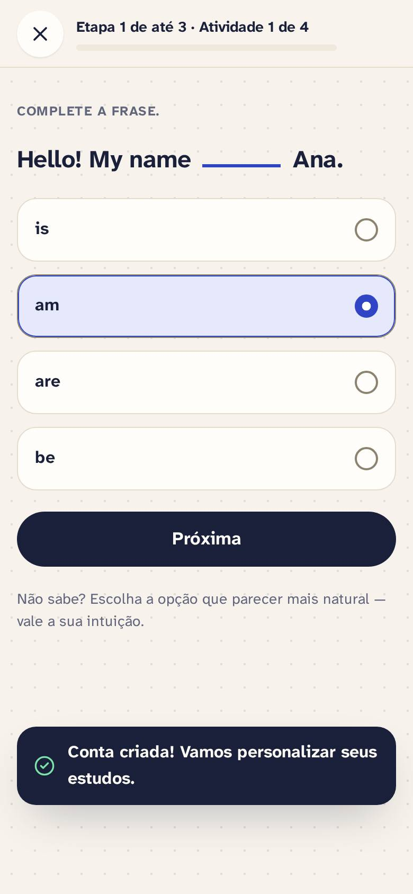 | 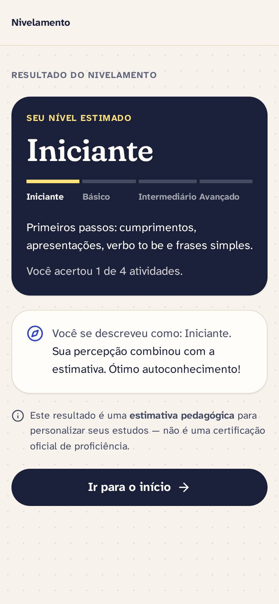 |

- **Introdução:** quantas perguntas, tempo estimado e que o resultado é uma estimativa; opção **Prefiro começar do zero**
  (começa como Iniciante).
- **Perguntas:** etapas progressivas (Iniciante → Básico → Intermediário); avança de etapa com 3 de 4 acertos.
- **Resultado:** "Seu nível estimado" + comparação com a autoavaliação + aviso de que não é certificação.
- **Ação:** **Ir para o início**. Refazer pelo perfil (`/perfil/nivelamento`).
- **Sair:** no primeiro acesso, o "X" da barra (introdução e perguntas) abre o diálogo "Sair da conta?" (ao entrar
  de novo, a pessoa retoma o nivelamento). Ao **refazer** pelo perfil, o mesmo "X" volta ao perfil sem alterar o
  nível.
- **Começar nivelamento** mostra "Preparando…" e desabilita **Prefiro começar do zero** (e vice-versa); **Ir para o
  início** mostra carregamento. Nenhum aceita clique duplo, e uma falha aparece na tela com a ação disponível de
  novo.

## App

### 7. Início — `/inicio` (RN01, RN06, RF16)

| Celular | Tablet | Desktop |
| --- | --- | --- |
| 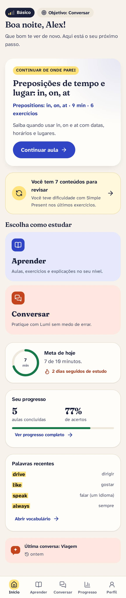 | 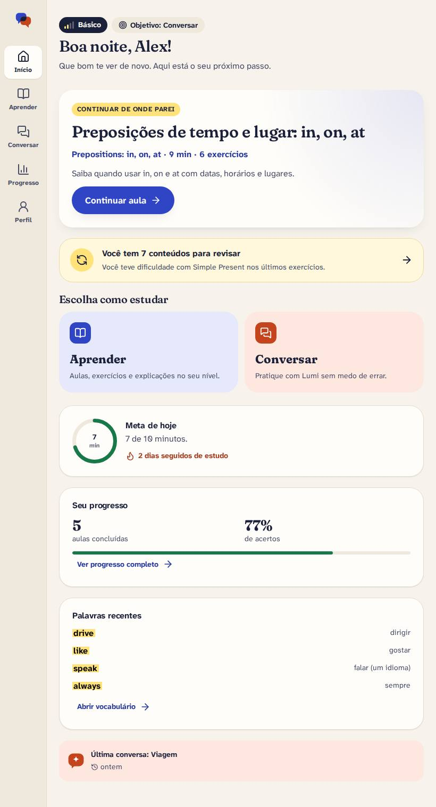 | 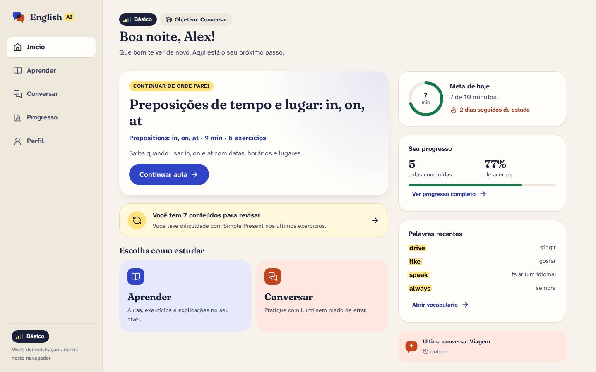 |

- **Conteúdo:** nível estimado + objetivo → saudação → **Continuar de onde parei** (próxima aula, ação
  principal) → revisões pendentes (total + motivo da primeira) → escolha do modo (Aprender / Conversar) → meta de
  hoje (anel) e sequência → resumo do progresso → palavras recentes → última conversa.
- **Estados:** usuário novo (primeira aula em destaque, sem cartões vazios); todas as aulas concluídas.
- **Desktop:** coluna lateral "Resumo do dia" com meta, progresso e palavras.

### 8. Aprender — `/aprender` (UC05, RF06, RF07, RN02, RN03)

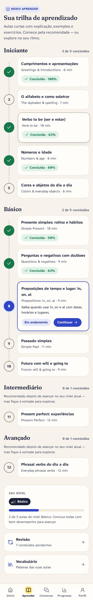

Trilha por nível (Iniciante → Avançado) com estado de cada aula (concluída com nota, em andamento, próxima,
disponível) e nota para níveis acima do estimado ("Recomendado depois de avançar…", sem bloquear).

### 9. Aula — `/aprender/aula/:id` (UC05–UC07, RF06–RF11, RN05) — imersiva

| Explicação | Feedback de exercício | Correção de escrita |
| --- | --- | --- |
| 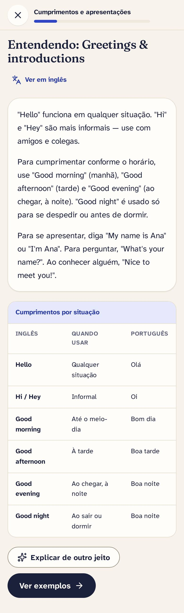 | 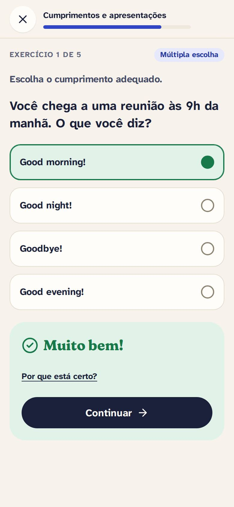 | 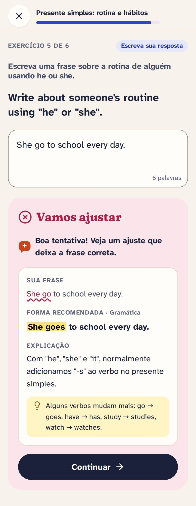 |

- **Etapas:** apresentação (objetivos, tempo, nº de exercícios) → explicação (com **Explicar de outro jeito**) →
  exemplos (com **Me dê outro exemplo**) → vocabulário → exercícios → resumo.
- **Barra de foco:** sair, título e progresso da aula.
- **Resumo:** acertos (anel), tempo, palavras novas, **Praticar isso na conversa**, revisão sugerida se a nota
  for baixa, próxima aula.
- **Desktop:** sumário fixo das etapas à esquerda. [desktop-03](./screenshots/desktop-03-aula.jpg)

### 10. Conversar — `/conversar` (UC09, RF12, RN06)

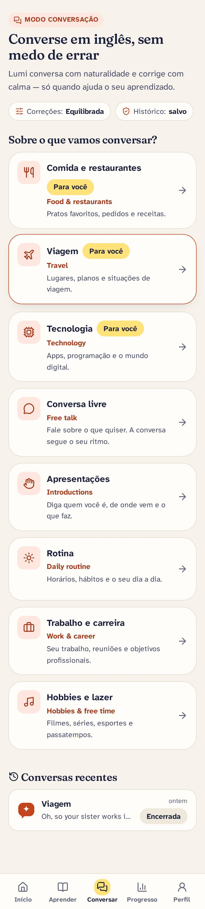

- Atalhos para as preferências (intensidade de correção, histórico) → assuntos com até 3 marcados
  "Para você" (interesses do perfil) e aviso quando acima do nível → conversas recentes (se o histórico estiver
  ativo) ou aviso de histórico desativado.

### 11. Conversa — `/conversar/:id` (UC09, RF12–RF14, RN04) — imersiva

| Celular | Desktop |
| --- | --- |
| 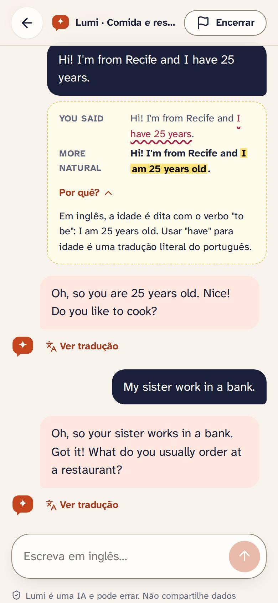 | 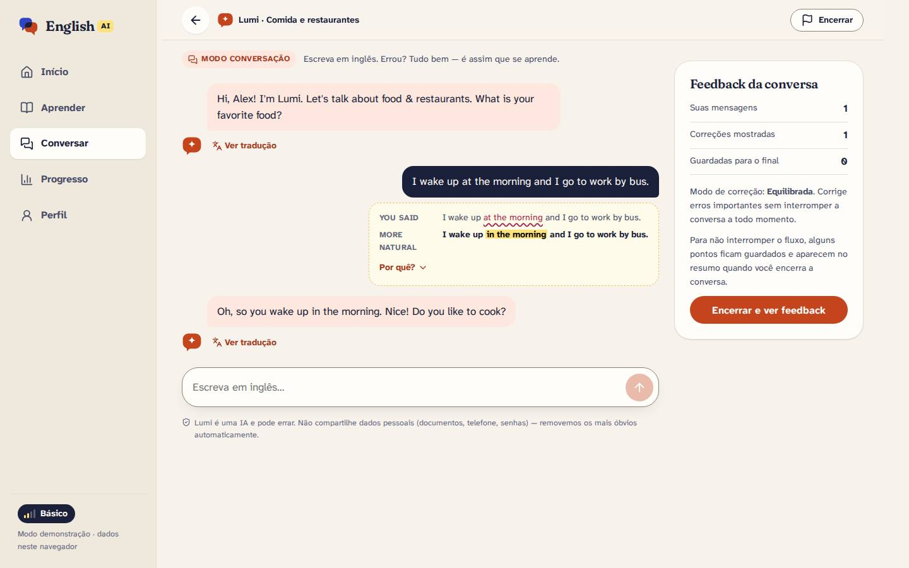 |

- **Barra de foco:** voltar, "Lumi · assunto", **Encerrar** (após a primeira mensagem).
- **Mensagens:** Lumi à esquerda (balão coral claro, "Ver tradução" nos níveis iniciais); usuário à direita
  (balão tinta); correção discreta abaixo da mensagem do usuário ("You said / More natural / Por quê?");
  avisos de privacidade quando algo é removido.
- **Composer:** área de texto que cresce, Enter envia, contador perto do limite; rodapé "Lumi é uma IA e pode
  errar…".
- **Estados:** IA preparando resposta (balão com três pontos), erro ao enviar (texto volta ao campo),
  conversa encerrada.
- **Encerrar:** diálogo de confirmação (avisa se o conteúdo será apagado).
- **Desktop:** painel "Feedback da conversa" com contadores (mensagens, correções mostradas, guardadas para o
  final) e explicação da intensidade.

### 12. Feedback da conversa (após encerrar)

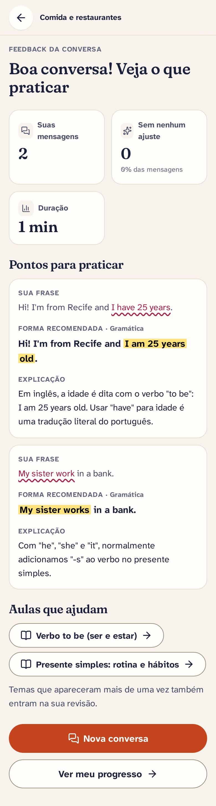

Título ("Boa conversa! Veja o que praticar" ou "Conversa impecável!") → mensagens, mensagens sem ajuste, duração
→ aviso se o conteúdo foi apagado → **Pontos para praticar** (CorrectionCard completo) → **Aulas que ajudam** →
**Nova conversa** / **Ver meu progresso**.

### 13. Progresso — `/progresso` (UC11, RF15, RF16)

| Celular | Desktop |
| --- | --- |
| 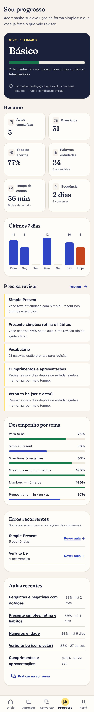 | 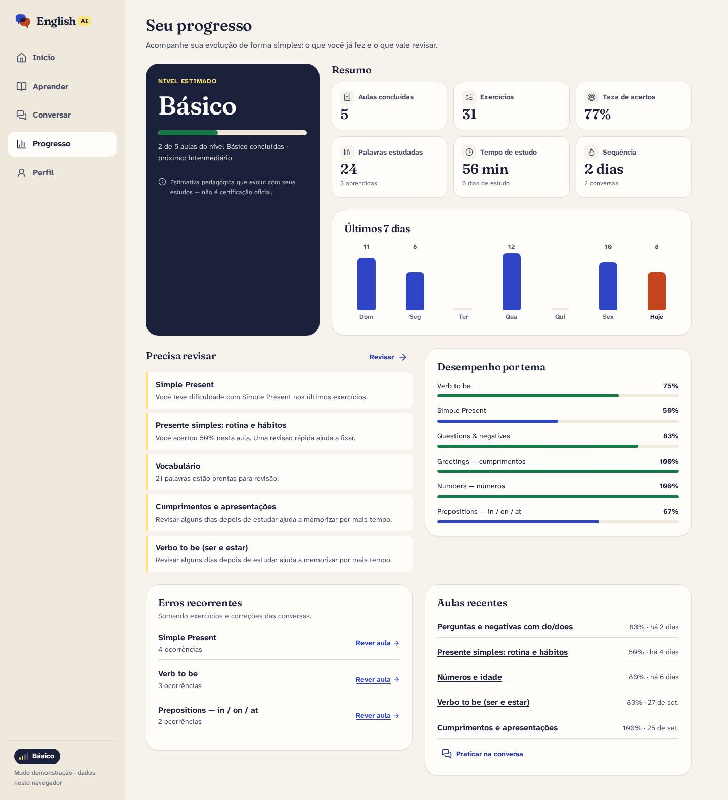 |

Especificação da visualização: [UX-SPECIFICATION.md §7](../docs/UX-SPECIFICATION.md#7-visualização-do-progresso).
Tablet: [tablet-03](./screenshots/tablet-03-progresso.jpg).

### 14. Revisão — `/revisao` e `/revisao/:id` (UC08, RF18)

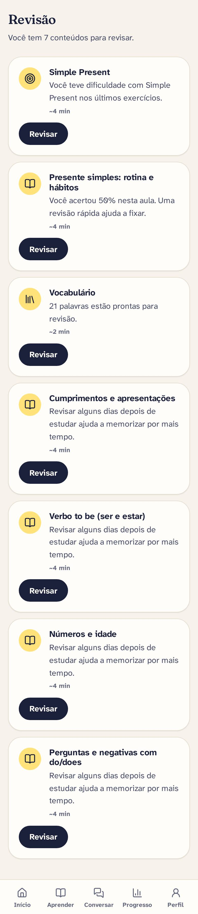

- Fila com o **motivo** de cada item (erros, nota baixa, intervalo de repetição, conversa, palavras prontas
  para revisar) e quando foi agendado.
- Sessão de revisão usa o mesmo `ExerciseRunner`; ao final mostra a nota e a próxima data (intervalos de
  1, 3, 7, 14 e 30 dias).

### 15. Vocabulário — `/vocabulario` (UC10, RF08, RF17)

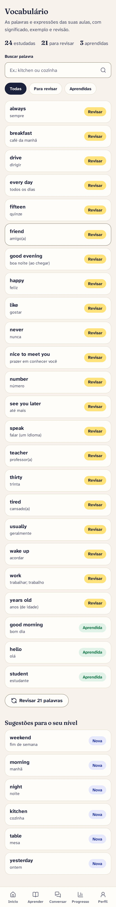

Busca, filtros (Todas, Para revisar, Aprendidas), lista com palavra + tradução + estado; diálogo com
significado, exemplos, link para a aula e as ações "Quero revisar de novo" / "Já aprendi". Link direto: `/vocabulario?palavra=<id>`.

### 16. Perfil — `/perfil` (UC03, RF03, RF04)

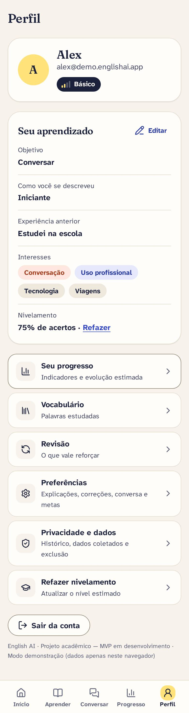

Nome, e-mail, nível estimado, objetivo e interesses → **Editar** · **Refazer** nivelamento → atalhos
(Progresso, Vocabulário, Revisão, Preferências, Privacidade, Refazer nivelamento) → **Sair da conta**.

**Sair da conta:** o botão mostra "Saindo…" e não aceita clique duplo; em seguida a pessoa vai para `/entrar` com
o toast "Você saiu da sua conta." (nunca "Sua sessão expirou"). Os dados da conta saem da memória do app, e
Voltar/Avançar do navegador não reabrem telas privadas. Se a saída falhar (sem conexão), a mensagem aparece abaixo
do botão e a pessoa continua na conta.

### 17. Preferências — `/preferencias` (UC12, RF19)

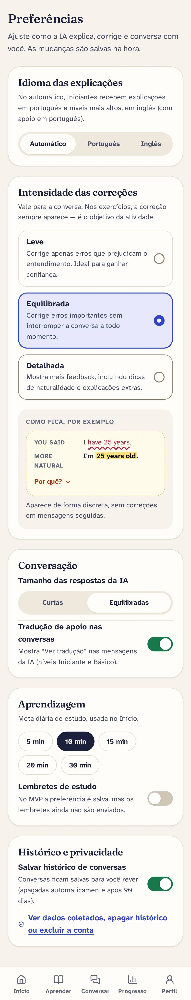

Idioma das explicações · intensidade das correções (com pré-visualização ao vivo do CorrectionCard) · tamanho
das respostas · tradução de apoio · meta diária · lembretes (salvos, envio fora do MVP) · salvar histórico de
conversas. Cada alteração salva na hora com toast.

### 18. Privacidade e dados — `/privacidade` (RF20, RNF05, RN07)

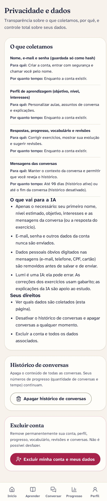

Tabela de dados coletados (empilhada no celular) → o que vai para a IA → direitos → **Apagar todas as
conversas** → **Excluir minha conta** (diálogo com senha).

Depois de excluir: a pessoa vai para a página pública com o toast "Sua conta e seus dados foram
excluídos."; Voltar não reabre telas privadas. Senha errada: mensagem no diálogo e campo limpo. Fechar e reabrir
um diálogo começa do zero; **Cancelar** fica desabilitado enquanto a exclusão está em andamento.

### 19. Página não encontrada — `*`

Mensagem amigável e botão para o Início (ou para a página pública, sem sessão).
