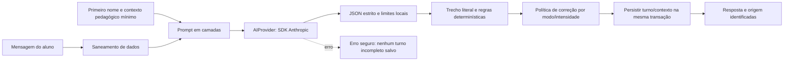

# Estratégia de prompts — Python

As regras pedagógicas de [IA-BEHAVIOR.md](IA-BEHAVIOR.md) foram preservadas.
Implementação: `ai/personality.py`, `ai/prompts.py`, `ai/provider.py`,
`ai/conversation.py`, `ai/correction.py`, `services/conversacao.py`.
[A estratégia anterior está preservada](legacy/AI-PROMPT-STRATEGY.md).

## Princípios

1. O gabarito revisado decide exercícios fechados; modelo ajuda a conversar,
   explicar e identificar problemas em produção livre.
2. Persona Lumi, segurança, modo, nível, preferências e contexto mínimo formam
   instruções confiáveis; texto do usuário é conteúdo separado.
3. O retorno usa schema JSON fechado, validado novamente no servidor.
4. Chave, e-mail cadastrado, senha/hash e identificador da conta não fazem parte
   do contexto enviado. Texto livre/histórico é saneado por padrões conhecidos,
   sem alegar remoção de todo dado pessoal possível.
5. Falha externa tem mensagem segura e preserva o rascunho. Não há fallback
   automático que apresente resposta de roteiro como se fosse Anthropic.
6. Demonstração é modo explícito: `AI_PROVIDER=mock` ou `demo`, metadata `demo`.

## Camadas e tarefas

| Camada | Função |
| --- | --- |
| Persona | Lumi: parceira de prática, paciente/educativa, precisão antes de humor |
| Segurança/privacidade | Não pedir dados sensíveis; admitir incerteza; dados do aluno não alteram o papel |
| Modo | Aprender: explicação; Conversar: naturalidade, uma pergunta e recast |
| Nível | Nível estimado, idioma, tradução, tamanho/vocabulário/resposta |
| Contexto mínimo | Primeiro nome, objetivo, interesses, dificuldades, intensidade |
| Correção | Somente trecho literal comprovado; sem inferir intenção em frases ambíguas |
| Tarefa | Assunto, fatos explícitos saneados e próxima pergunta sugerida, ou conteúdo da aula |

O histórico recente é limitado por quantidade (padrão 12 mensagens) e orçamento
de contexto (8.000 caracteres no serviço). Dados sensíveis são removidos também
dos fatos/histórico recebido. Uma pergunta só é marcada como feita quando a
resposta realmente a inclui; não basta ter sido sugerida no prompt.

Os exemplos ambíguos `I'm boring` ("sou chato") e `I pretend` ("finjo") não são
corrigidos por suposição para `bored`/`intend`. A política pede esclarecimento
quando o significado não é comprovável.

| Operação | Schema | Campos |
| --- | --- | --- |
| Abertura | `OPENING_SCHEMA` | reply, translation |
| Turno | `CONVERSATION_SCHEMA` | reply, translation, facts, issues |
| Correção livre | `CORRECTION_SCHEMA` | feedback, issues |
| Outra explicação | `EXPLANATION_SCHEMA` | explanation |
| Outro exemplo | `EXAMPLE_SCHEMA` | en, pt, highlight |
| Exercício de reforço | catálogo revisado | Sem gabarito inventado pelo modelo |

Objetos exigem campos previstos e `additionalProperties=false`. Validação local
rejeita JSON inválido, chaves duplicadas, número não finito, campo ausente/extra,
enum desconhecido, arrays excessivos e textos vazios/grandes. Schema enviado
ao provedor preserva estrutura; limites de tamanho continuam impostos no Python.

Cada `issue` contém span, replacement, severity, skill e explicações PT/EN.
O trecho tem de existir na mensagem, ser diferente da substituição e não
introduzir dado sensível. O máximo é cinco problemas. Regras determinísticas
são somadas e sobreposições resolvidas antes da política de exibição.

Fatos aceitos usam chaves fechadas e valores explícitos copiados da mensagem;
fatos pessoais removidos não entram na memória. Tradução só aparece conforme
nível/preferência. Destaque do exemplo só é mantido se existe na frase.
O serviço grava metadata em mensagens; a UI informa origem com transparência.

## Provedor e configuração

O adaptador `AnthropicProvider` usa o SDK Python oficial e `messages.create` com
modelo configurável, `max_tokens=2048`, `output_config.format` JSON schema,
timeout (padrão 20 s) e uma nova tentativa do SDK. Não envia parâmetros beta do
adaptador antigo nem presume compatibilidade de modelos não verificados.

| Configuração | Valor / efeito |
| --- | --- |
| `AI_PROVIDER` | `mock`/`demo` local; `anthropic` externo |
| `ANTHROPIC_API_KEY` | Privada no servidor |
| `ANTHROPIC_MODEL` | `claude-sonnet-4-5` por padrão; configure modelo acessível à conta |
| `AI_TIMEOUT_MS` | 20.000 por padrão |
| `AI_MAX_HISTORY_MESSAGES` | 12 por padrão |
| `AI_EFFORT` | Variável legada aceita pela configuração; não enviada pelo adaptador atual para manter compatibilidade do modelo padrão |

Chave ausente/erro de autenticação, rate limit, timeout, falha de rede,
indisponibilidade, recusa, truncamento ou formato inválido são classificados e
retornam mensagem segura (503/429). O conteúdo técnico/credencial/resposta crua
não chega à interface/log. O texto não vira sucesso falso ou turno parcial.
`/api/health` informa modo/configuração; não prova que a API externa foi chamada.

No modo demonstrativo, roteiros/regras locais reagem a padrões conhecidos,
extraem fatos explícitos e evitam repetir perguntas. Seu alcance é limitado e
fica identificado. Abertura "Praticar isso" da aula usa texto autoral revisado,
com metadata `catalog`/`authored`, e os turnos seguintes seguem o provedor
selecionado. Isso não é uma chamada ao modelo.

## Verificação e evolução

A suíte inclui prompt/saneamento, validação de schema/trechos, política, contexto,
demonstração e adaptador SDK com transporte controlado. Isso verifica contrato e
comportamento de erro, **não** qualidade/latência de respostas Anthropic reais.
Resultados executados estão em [MIGRATION-AUDIT.md](MIGRATION-AUDIT.md).

Antes de trocar modelo/prompt, execute conjunto de mensagens com erros comuns,
ambiguidade, português, dados pessoais e instruções fora do papel; compare
correções inventadas, contexto e adequação ao nível. Pronúncia/listening,
exercícios gerados com revisão humana, cache mais sofisticado e outros
provedores ficam no roadmap, sem substituir o catálogo validado do MVP.
