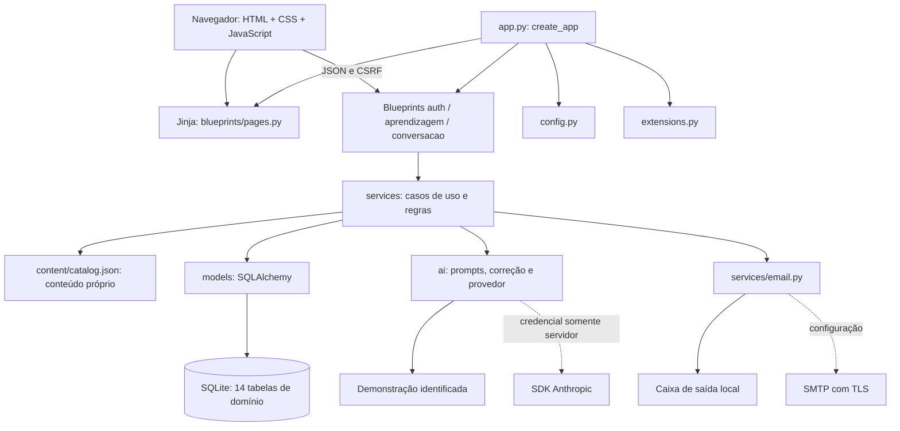

# Arquitetura — English AI em Python

A aplicação principal usa Python 3.12, Flask, SQLAlchemy e Jinja. Preserva a
arquitetura acadêmica **Aplicação → Backend → Banco / Motor de IA**, os dois
modos pedagógicos e os UC01–UC12. A organização anterior está em
[legacy/ARCHITECTURE.md](legacy/ARCHITECTURE.md); a auditoria e as decisões de
transição estão em [MIGRATION-AUDIT.md](MIGRATION-AUDIT.md).

## Objetivos e decisões

- Manter os requisitos e o conteúdo próprios do English AI.
- Executar a aplicação e suas regras em Python, sem compilação TypeScript.
- Separar HTTP, serviços de negócio, ORM, IA e apresentação.
- Corrigir exercícios fechados pelo gabarito revisado e calcular notas no servidor.
- Permitir IA demonstrativa identificada e integração externa configurável.
- Respeitar sessão, propriedade dos dados, retenção e exclusão.

O NEXO foi referência de factory, configuração, Blueprints, Jinja e migrações.
Não foram incorporados regras financeiras, ETL, multiempresa, visual do NEXO ou
Socket.IO. O English AI não exige esses componentes.



## Estrutura e responsabilidades

```text
app.py                    factory, cabeçalhos, erros, CLI e servidor local
config.py                 configuração validada por ambiente
extensions.py             db, login, csrf, limiter, migrate
requirements.in/.txt      dependências diretas e versões fixadas
blueprints/               páginas Jinja e API por contexto
models/                   14 tabelas, serialização pública e migração segura
services/                 autenticação, perfil, aprendizagem, revisão, progresso, e-mail
ai/                       provedores, personalidade, prompts e correção
content/                  catálogo autoral JSON e acesso Python
database/                 seed idempotente, insere só conteúdo ausente
migrations/               revisões Alembic
templates/                base, macros e páginas por função
static/                   CSS, JavaScript por responsabilidade e fontes locais
tests/                    pytest, SQLite temporário e interface
.vscode/                  tarefas e execução para VS Code
docs/                     requisitos, arquitetura, auditoria e guias
docs/legacy/              documentos preservados da implementação anterior
apps/, packages/, e2e/    implementação TypeScript preservada para comparação
```

`create_app(config)` permite uma configuração de teste sem compartilhar banco
ou sessão. Extensões são criadas em `extensions.py` e vinculadas na factory para
evitar importar a instância de aplicação em todos os módulos.

As rotas validam o corpo e chamam serviços. Estes resolvem usuário/dono do
recurso, aplicam regras e persistem transações. Templates organizam estrutura e
texto; scripts tratam formulário, carregamento, navegação e feedback. Gabarito,
nível, revisões, senha, IA e persistência ficam no Python.

O navegador recebe o mesmo contrato de erros (`error.code`, `message`, `fields`)
e dados em camelCase usados pelo cliente integrado anterior. Essa compatibilidade
não implica reutilização de JWT ou execução do antigo núcleo no navegador.

## Comunicação e rotas

Páginas principais: `/`, `/cadastro`, `/entrar`, `/recuperar-senha`,
`/redefinir-senha/<token>`, `/configuracao`, `/nivelamento`, `/inicio`, `/aprender`,
`/aprender/aula/<id>`, `/conversar`, `/conversar/<id>`, `/revisao`, `/revisao/<id>`,
`/vocabulario`, `/progresso`, `/perfil`, `/perfil/editar`, `/perfil/nivelamento`,
`/preferencias`, `/privacidade` e `/termos-e-privacidade`.

| API sob `/api` | Responsabilidade |
| --- | --- |
| `GET /csrf` | Token CSRF para solicitações mutáveis |
| `GET /health` | Disponibilidade local do banco e metadata da IA; não faz chamada paga ao provedor |
| `/auth/register`, `/auth/login`, `/auth/logout`, `/auth/session` | Conta e sessão |
| `/auth/password-reset`, `/verify`, `/confirm` | Pedido, situação do link e nova senha |
| `/me`, `/me/profile`, `/me/preferences` | Conta, perfil, preferências e exclusão |
| `/placement/start`, `/placement/answers`, `/placement/skip` | Nivelamento estimado |
| `/lessons` e `/lessons/<id>/…` | Trilha, aula, início, respostas, conclusão, explicação e exemplo |
| `/reviews` e `/reviews/<id>/…` | Fila, sessão, respostas e conclusão |
| `/vocabulary` e `/vocabulary/<id>/…` | Palavras e estado de estudo |
| `/home`, `/progress` | Indicadores recuperados do banco |
| `/conversation-topics`, `/conversations` e `/conversations/<id>/…` | Conversa, turnos, feedback e histórico |

A lista exata de métodos está nas rotas dos Blueprints. Recursos privados
exigem sessão; uma conversa/revisão de outro usuário responde como inexistente.
As guardas de páginas mantêm configuração → nivelamento → app; quem concluiu
uma etapa não a repete no login. A redefinição abre com ou sem sessão.

## Sessão, segurança e privacidade

- Flask-Login usa cookie assinado com `SECRET_KEY`, httpOnly e SameSite=Strict;
  em produção é Secure. O identificador de login inclui versão da sessão,
  conferida contra `users.session_version` a cada requisição.
- Logout, troca de senha e exclusão encerram a identidade do navegador; mudança
  da versão invalida cookies anteriores. Não há sessão/token em `localStorage`.
- `X-Session-User` permite recusar resposta privada quando a conta do cookie
  difere da conta exibida pela página. Não substitui autenticação.
- Flask-WTF exige CSRF em POST/PUT/PATCH/DELETE, inclusive na autenticação.
  Scripts obtêm token da página/API e tratam expiração sem exibir sucesso falso.
- Flask-Limiter limita requisições. `memory://` serve ao desenvolvimento/uma
  instância; infraestrutura distribuída exige backend compartilhado suportado.
- SQLAlchemy usa consultas parametrizadas; entradas são validadas e templates
  Jinja escapam conteúdo. Scripts não devem inserir mensagens como HTML bruto.
- CSP restringe scripts, fontes e comunicação à própria origem. Erros internos
  retornam mensagem em português e registram apenas classe/código apropriado.
- Senhas/tokens/chaves e texto privado não são registrados. A configuração e os
  links de e-mail têm requisitos próprios em [EMAIL-AND-AUTH.md](EMAIL-AND-AUTH.md).

A IA recebe primeiro nome e contexto pedagógico mínimo. Padrões reconhecidos
de e-mail, telefone, CPF, cartão e senha declarada são saneados antes de
persistir/enviar; isso não identifica todo dado pessoal possível em texto livre.
O usuário pode
apagar uma conversa/histórico e excluir a conta. Histórico desligado significa
conversa temporária, com conteúdo removido ao encerrar e expiração de segurança;
histórico salvo tem retenção configurável (padrão 90 dias). A CLI
`purge-private-data` permite aplicar a limpeza periodicamente. O texto de
privacidade é informativo e permanece pendente de revisão jurídica.

## Pedagogia, resultados e consistência

O catálogo contém aulas ordenadas por dificuldade, explicações PT/EN,
exercícios, palavras e temas de conversa. Nível é uma **estimativa pedagógica**.
Conteúdo acima do nível é sinalizado; não se impõe bloqueio inventado para o MVP.

Cada passagem de aula/revisão vincula suas tentativas ao contexto correto.
O servidor calcula resultado a partir dessas linhas, rejeita conclusão
incompleta e reutiliza resultado quando a mesma operação é reenviada. Uma
passagem intencional nova pode repetir o conteúdo. Chaves de idempotência e
restrições do banco evitam contabilizar a mesma resposta duas vezes.

Vocabulário e revisão usam intervalo, motivo e desempenho próprios. O andamento
já salvo permite retomar a aula. Progresso, taxa de acertos, sequência e dias de
estudo são calculados sobre dados reais (fuso `America/Sao_Paulo`). Uma conta
sem atividade recebe estado vazio, nunca números ilustrativos como resultado.

A conversa preserva contexto mínimo e últimas mensagens dentro do limite.
O provedor sugere problemas; a política de correção decide exibição na mensagem
ou resumo, preservando **naturalidade acima de correção excessiva**. O serviço
valida resposta e grava turno/contexto conjuntamente; falha de gravação deve
produzir erro sem turno incompleto. Resposta local tem metadata explícita `demo`; abertura revisada de aula usa
`catalog`/`authored`. Falha externa retorna erro seguro sem gravar turno e sem
fallback automático para roteiro. Selecionar demonstração é decisão explícita.

O POST de mensagens aceita `Idempotency-Key`. Após o commit, repetir a mesma
chave/texto recupera o resultado salvo sem novo turno nem chamada externa. A UI
reutiliza a chave ao tentar novamente depois de perder a resposta; uma repetição
intencional usa nova chave. Mesma chave com texto diferente retorna conflito.
Chamadas simultâneas podem consultar o provedor antes da disputa otimista, que
persiste uma única dupla; não há garantia de uma única cobrança externa nessa
condição. Exclusão/expiração remove o cache privado junto com as mensagens.

## Banco, operação e limitações

O esquema preserva as 14 tabelas anteriores e acrescenta campos para passagem,
resultado/idempotência e metadata de IA. SQLAlchemy lê os JSON/datas legados.
Alembic versiona alterações e o importador trabalha em uma cópia verificada;
[DATABASE-MODEL.md](DATABASE-MODEL.md) contém DER e índices.

Desenvolvimento inicializa banco/conteúdo novo; produção exige aplicação
explícita das migrações e seed antes do servidor. `python app.py` é servidor
local de desenvolvimento, com debug desligado. Implantação com WSGI/HTTPS,
backup periódico e agendamento de limpeza são tarefas operacionais separadas.
PostgreSQL, Redis, fila de e-mails e múltiplas instâncias permanecem evolução;
a versão com SQLite não é uma validação de escala horizontal.

Permanecem fora do MVP voz, pronúncia automática, ranking, gamificação avançada,
certificação, marketplace e vídeo. Preferência de lembrete não gera notificação.
Não há confirmação de e-mail, painel administrativo ou nova tentativa durável
para envio SMTP. IA real, SMTP real, navegador/aparelho não executado e Windows
não recebem afirmação de validação por existir integração ou guia.
