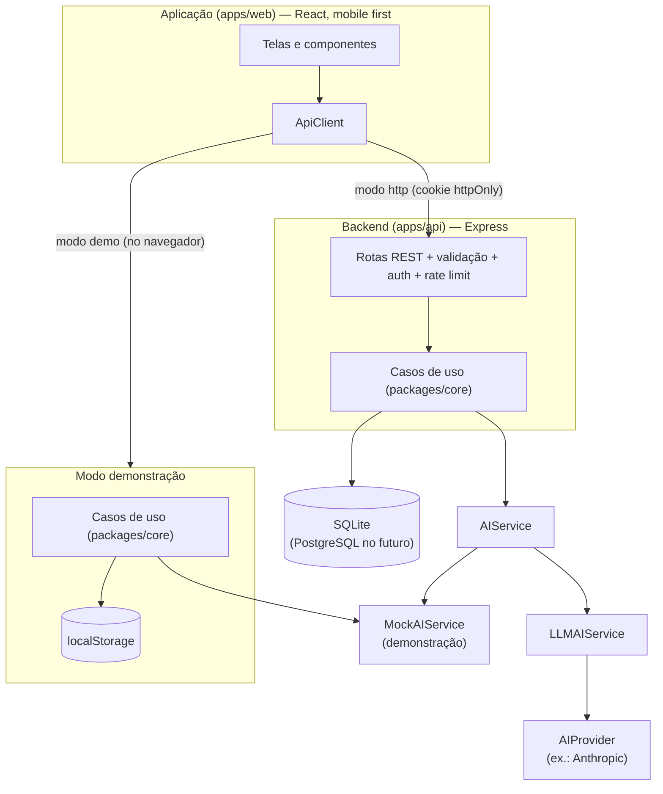
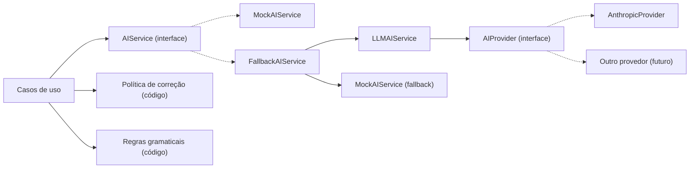

# Arquitetura inicial — English AI

> Projeto acadêmico — MVP em desenvolvimento. Este documento descreve a arquitetura **implementada** neste repositório e as decisões tomadas. A Análise de requisitos (§19) indica que "a arquitetura definitiva será definida durante a fase de projeto técnico" — esta é a proposta inicial.

## 1. Objetivo arquitetural

1. **Fidelidade ao MVP**: entregar os casos de uso UC01–UC12 sem antecipar recursos fora do escopo.
2. **IA substituível**: nenhuma parte do sistema depende de um provedor específico (Risco 3).
3. **Funcionar sem chave de IA**: protótipo navegável em modo demonstração (sem custo — Risco 1).
4. **Regras pedagógicas em um só lugar**: as mesmas regras rodam na API e no modo demonstração, sem duplicação.
5. **Segurança e privacidade desde o início** (RNF04, RNF05, §21, §22).
6. **Modularidade** para manutenção e evolução (RNF08).

## 2. Visão geral



A arquitetura segue a proposta conceitual dos documentos — **Aplicação → Backend → (Banco de Dados | Motor de IA)** — com uma adição: o **modo demonstração**, em que os mesmos casos de uso rodam no navegador para que o protótipo seja navegável sem servidor.

## 3. Estrutura do repositório

```text
.
├── apps/
│   ├── api/                 Backend HTTP (Express + SQLite)
│   │   └── src/
│   │       ├── config/      leitura e validação de variáveis de ambiente
│   │       ├── db/          conexão, schema.sql, seed do conteúdo
│   │       ├── repositories/ implementação SQLite das portas do core
│   │       ├── security/    hash de senha (scrypt) e tokens de sessão
│   │       ├── ai/          provedores reais de IA (chave só no servidor)
│   │       ├── http/        app, rotas, middlewares, tratamento de erros
│   │       └── logger.ts    logs estruturados com redação de dados sensíveis
│   └── web/                 Aplicação React (Vite)
│       └── src/
│           ├── app/         rotas, provedores, guardas de navegação
│           ├── components/  componentes reutilizáveis (design system)
│           ├── layouts/     estrutura das páginas (shell, auth)
│           ├── features/    telas por funcionalidade (auth, onboarding, placement,
│           │                home, learning, exercises, conversation, vocabulary,
│           │                review, progress, profile, settings, legal)
│           ├── services/    ApiClient (demo e http)
│           ├── mocks/       dados de demonstração (separados dos dados reais)
│           ├── hooks/ utils/ styles/
└── packages/
    └── core/                Núcleo independente de framework
        └── src/
            ├── domain/      entidades, regras puras (correção, nivelamento, progresso, revisão)
            ├── content/     conteúdo pedagógico próprio (aulas, vocabulário, nivelamento, assuntos)
            ├── ai/          AIService, persona, adaptação ao nível, política de correção,
            │                regras gramaticais, prompts, modo demonstração, LLM + fallback
            ├── application/ casos de uso (UC01–UC12) e portas (interfaces) de persistência
            └── infrastructure/ armazenamento chave-valor e hash PBKDF2 (portáveis)
```

## 4. Camadas

### 4.1 Frontend (`apps/web`)

- **React 19 + Vite + TypeScript**, React Router e TanStack Query (estados de carregamento, erro e cache).
- **Mobile first** com layouts próprios para tablet e desktop (ver `docs/UX-SPECIFICATION.md`).
- **`ApiClient`** é a única porta de dados das telas. Duas implementações:
  - `DemoApiClient`: executa os casos de uso do `core` no navegador, com `localStorage` e IA de demonstração;
  - `HttpApiClient`: conversa com a API REST (`/api`), com cookie de sessão httpOnly.
- Modo escolhido por `VITE_API_MODE` (`demo` padrão, ou `http`).
- **Nenhum segredo** no front-end: só variáveis `VITE_*`, que são públicas por definição.

### 4.2 Backend (`apps/api`)

- **Express 5 + TypeScript**, executado com Node 22.
- Responsabilidades: autenticação e sessão, validação de entrada (zod), controle de acesso por dono do recurso, limitação de taxa, logs, persistência e acesso ao provedor de IA.
- Regras de negócio **não** ficam nas rotas: as rotas chamam os casos de uso do `core`.

### 4.3 Núcleo (`packages/core`)

- TypeScript puro, sem dependências de framework.
- **Portas** (`application/ports.ts`) definem o que os casos de uso precisam: repositórios, hash de senha, relógio, gerador de ids e `AIService`.
- Os casos de uso recebem as dependências por injeção (`createAppServices(deps)`), o que facilita testes e troca de infraestrutura.

### 4.4 Banco de dados

- **SQLite** (módulo nativo `node:sqlite`) no MVP: zero instalação, arquivo local em `data/` (ignorado pelo git).
- Esquema relacional em `apps/api/src/db/schema.sql`, com chaves estrangeiras e `ON DELETE CASCADE` (exclusão de dados — RF20).
- Repositórios assíncronos: migrar para **PostgreSQL** exige apenas novas implementações das portas.
- Conteúdo pedagógico é versionado em código e sincronizado no banco na inicialização (seed idempotente), mantendo a integridade referencial de progresso e tentativas.

### 4.5 Inteligência Artificial



- `AIService` define as capacidades pedagógicas: `startConversation`, `conversation`, `explain`, `anotherExample`, `correct`, `generateExercise`.
- **Decisões importantes:**
  - A **correção de exercícios fechados é determinística** (gabarito). A IA explica, mas não decide se uma alternativa está certa.
  - A **política de correção** (o que mostrar, quando e quanto) é aplicada **em código**, independentemente do modelo.
  - As **regras gramaticais determinísticas** rodam também com provedor real, como rede de segurança.
  - Correções sugeridas pelo modelo só são aceitas se o trecho citado **existir** na mensagem do usuário.
  - Exercícios "gerados" vêm do catálogo revisado; gabaritos criados por IA não são confiáveis o bastante para o MVP.
  - A adaptação de conteúdo **já existente** ao nível é determinística (sem custo); a IA é usada para produzir conteúdo **novo** (outra explicação, outro exemplo, conversa).
- Detalhes: [IA-BEHAVIOR.md](./IA-BEHAVIOR.md) e [AI-PROMPT-STRATEGY.md](./AI-PROMPT-STRATEGY.md).

## 5. Comunicação entre camadas

| De → Para | Mecanismo | Formato |
|-----------|-----------|---------|
| Web → API | HTTPS, REST, `fetch` com `credentials: 'include'` | JSON |
| API → Core | chamada de função | objetos tipados (DTOs em `application/views.ts`) |
| Core → Banco | portas de repositório | entidades de domínio |
| Core → IA | `AIService` → `AIProvider.complete()` | prompt em camadas + resposta JSON validada |

Principais rotas da API (todas sob `/api`):

| Método | Rota | Caso de uso |
|--------|------|-------------|
| POST | `/auth/register`, `/auth/login`, `/auth/logout`, `/auth/password-reset` | UC01, UC02 |
| GET | `/auth/session` | estado da sessão (conta ou `null`, sem 401 para visitantes) |
| GET/DELETE | `/me` | sessão, RF20 |
| PUT | `/me/profile` | UC03 |
| GET/PATCH | `/me/preferences` | UC12 |
| POST | `/placement/start`, `/placement/answers`, `/placement/skip` | UC04 |
| GET | `/home`, `/progress` | Página inicial, UC11 |
| GET/POST | `/lessons`, `/lessons/:id`, `/lessons/:id/start`, `/lessons/:id/exercises/:exerciseId/answer`, `/lessons/:id/complete`, `/lessons/:id/explain`, `/lessons/:id/example` | UC05, UC06, UC07 |
| GET/POST/DELETE | `/conversation-topics`, `/conversations`, `/conversations/:id`, `/conversations/:id/messages`, `/conversations/:id/end` | UC09 |
| GET/PUT | `/vocabulary`, `/vocabulary/:id`, `/vocabulary/:id/status` | UC10 |
| GET/POST | `/reviews`, `/reviews/:id/session`, `/reviews/:id/answers`, `/reviews/:id/complete` | UC08 |
| GET | `/health` | monitoramento |

## 6. Autenticação

- **Senhas**: `scrypt` (N=16384, r=8, p=1, salt aleatório de 16 bytes) com comparação em tempo constante. Nunca são registradas em log nem retornadas.
- **Sessão**: JWT assinado (HS256) com `sub` = id do usuário e expiração (`AUTH_TOKEN_TTL_HOURS`), em **cookie httpOnly**, `SameSite=Strict`, `Secure` em produção e `path=/api`. O token não fica acessível ao JavaScript (mitiga XSS).
- **CSRF**: `SameSite=Strict` + CORS restrito à origem do front-end + cabeçalho obrigatório `X-Requested-With` em requisições que alteram dados (formulários de outros sites não conseguem enviá-lo).
- **Login sem enumeração por tempo**: quando o e-mail não existe, um hash fictício é verificado para equalizar o tempo de resposta.
- **Conta já existente (UC01-A2)**: o caso de uso exige avisar o usuário; a exposição é mitigada com limitação de tentativas.
- **Recuperação de senha**: no MVP a rota responde sempre a mesma mensagem genérica e **não envia e-mail** (não há serviço de e-mail configurado). Ver §12.
- **Modo demonstração**: contas ficam apenas no navegador, com senha em PBKDF2 (Web Crypto). É um protótipo — não é autenticação de produção.

## 7. Segurança

| Ameaça / requisito | Medida |
|--------------------|--------|
| Credenciais vazadas | scrypt, nenhuma senha em log, `.env` no `.gitignore`, `.env.example` sem valores |
| Chave de IA exposta | chave só no servidor (`ANTHROPIC_API_KEY`), nunca com prefixo `VITE_` |
| Acesso a dados de outra pessoa | todo recurso é buscado com verificação de dono; resposta `404` igual para "não existe" e "não é seu" |
| Entrada maliciosa | zod nas rotas + validação de domínio + limites de tamanho (corpo 16 kB, mensagem 600 caracteres, resposta 400) |
| Abuso / custo de IA | rate limit global, de autenticação e das rotas de IA; histórico enviado ao modelo limitado (`AI_MAX_HISTORY_MESSAGES`) |
| Prompt injection | instruções de segurança no system prompt, mensagem do usuário sempre no papel `user`, saída do modelo validada e saneada |
| Cabeçalhos HTTP | `helmet` (CSP, HSTS em produção, `X-Content-Type-Options`, etc.) |
| Logs com dados pessoais | logger com redação de campos sensíveis; conteúdo de mensagens nunca é registrado |
| Segredo de sessão ausente | obrigatório em produção (a API não sobe sem ele); em desenvolvimento é gerado temporariamente com aviso |

## 8. Privacidade (LGPD)

| Princípio | Como é atendido |
|-----------|-----------------|
| Finalidade e transparência (RNF05) | tela "Privacidade e dados" explica o que é coletado e por quê; aceite dos termos no cadastro |
| Necessidade / minimização | cadastro pede só nome, e-mail e senha; à IA vai apenas o primeiro nome e o contexto pedagógico; dados pessoais óbvios (e-mail, telefone, CPF, cartão) são removidos das mensagens antes de salvar e de enviar à IA |
| Controle do titular (RN07) | preferência "Salvar histórico de conversas"; apagar uma conversa ou todo o histórico; excluir a conta e todos os dados (RF20) |
| Retenção | conversas salvas expiram em `CONVERSATION_RETENTION_DAYS` (padrão 90); sem histórico, o conteúdo é apagado ao encerrar (ou em 24 h); rotina periódica de limpeza |
| Segurança | ver §7 |

Itens que dependem de decisão jurídica/organizacional (encarregado de dados, base legal formal, portabilidade em formato definido) estão em §12.

## 9. Persistência e dados

- Modelo e DER: [DATABASE-MODEL.md](./DATABASE-MODEL.md).
- Indicadores de progresso são **calculados** a partir dos registros (sem tabelas de agregados).
- Dados de demonstração (usuário "Alex") ficam em `apps/web/src/mocks/` e são carregados **somente** no modo demonstração, por ação explícita ("Explorar demonstração").

## 10. Escalabilidade (RNF06) e disponibilidade (RNF07)

- API **sem estado** (sessão no token): pode rodar em várias instâncias atrás de um balanceador.
- Para escalar: trocar SQLite por PostgreSQL (novas implementações das portas), mover o rate limit para um armazenamento compartilhado (Redis) e materializar indicadores de progresso.
- Conteúdo estático e front-end podem ir para CDN.
- **Dependência da IA**: timeout configurável (`AI_TIMEOUT_MS`) e *fallback* automático para o modo demonstração, mantendo o sistema utilizável quando o provedor falha.

## 11. Tratamento de erros, logs e configuração

- **Erros de domínio** (`AppError`) têm código estável (`VALIDATION`, `EMAIL_IN_USE`, `INVALID_CREDENTIALS`, `NOT_FOUND`, `RATE_LIMITED`, `AI_UNAVAILABLE`…). A API converte em status HTTP; o front-end converte em mensagens em português, sem termos técnicos.
- Erros inesperados retornam `500 INTERNAL` com mensagem genérica; detalhes ficam só no log do servidor.
- **Logs** estruturados em JSON (`logger.ts`): evento, rota, status, duração e id do usuário — sem senhas, tokens, e-mails ou conteúdo de mensagens.
- **Configuração** centralizada em `apps/api/src/config/env.ts`, validada na inicialização; exemplo documentado em `.env.example`.

## 12. Decisões técnicas, limitações e evolução

### Decisões

| Decisão | Motivo |
|---------|--------|
| Monorepo com `core` compartilhado | mesmas regras na API e no protótipo; sem duplicação |
| Web (React) em vez de app nativo | protótipo navegável em qualquer dispositivo; mobile first atende RNF01/RNF02; empacotar como PWA ou app nativo é evolução natural |
| SQLite nativo do Node | sem instalação de banco para rodar o MVP |
| Correção determinística + IA explicativa | reduz o risco de respostas incorretas (Risco 2) |
| Política de correção em código | garante RN04 independentemente do modelo |
| Cookie httpOnly em vez de token no `localStorage` | reduz impacto de XSS |
| Fuso `America/Sao_Paulo` para "dias de estudo" | público principal brasileiro (configurável) |

### Limitações atuais

- Recuperação de senha sem envio real de e-mail.
- Lembretes de estudo apenas como preferência salva (sem envio de notificações).
- Rate limit em memória (uma instância).
- Sem telas de administração de conteúdo (ator Administrador apenas preparado).
- Modo demonstração armazena dados só no navegador do usuário.
- Contagem de acertos de uma sessão de revisão é informada pelo cliente (afeta apenas as estatísticas do próprio usuário).

### Evolução futura (Análise de requisitos §25)

- Fase 3: revisão automática mais sofisticada, exercícios adaptativos gerados por IA com validação, gamificação.
- Fase 4: voz, pronúncia, listening (campo `phonetic` e interface `AIProvider` já preparados).
- Fase 5: trilhas de inglês profissional e para tecnologia.
- Infra: PostgreSQL, Redis, envio de e-mail, PWA/app nativo, painel administrativo.
