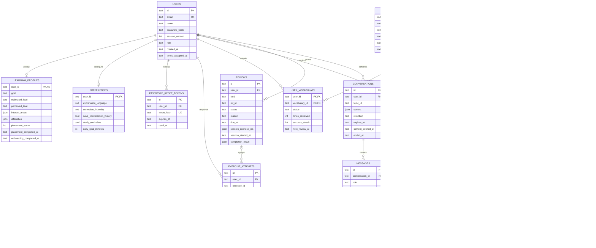
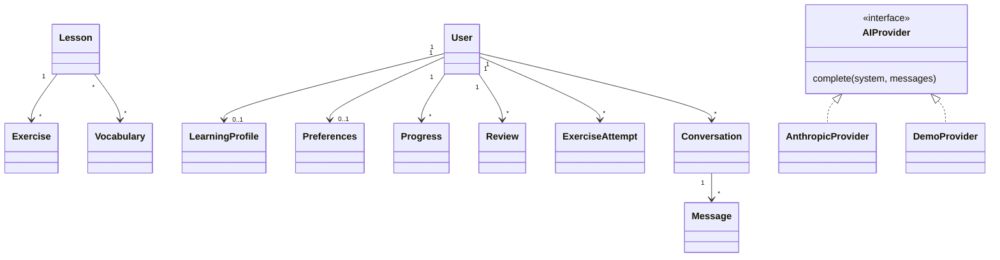

# Modelo de dados — English AI em Python

A origem acadêmica continua sendo a Análise de requisitos §20 (Usuário, Perfil,
Aula, Exercício, Vocabulário, Conversação, Progresso) e os casos de uso F2.
[O modelo anterior está preservado](legacy/DATABASE-MODEL.md). A implementação
atual está em `models/`, com SQLAlchemy 2 e migrações Alembic em `migrations/`.

## Entidades e rastreabilidade

| Tabela / modelo | Origem | Responsabilidade |
| --- | --- | --- |
| `users` / `User` | RF01–RF03, UC01–UC03 | Identidade, hash de senha, aceite dos termos, papel, versão da sessão |
| `password_reset_tokens` / `PasswordResetToken` | UC02, segurança | Hash SHA-256 do token, validade, uso único |
| `learning_profiles` / `LearningProfile` | RF03–RF05, RN06, UC03–UC04 | Objetivo, interesses, nível percebido/estimado, dificuldades, etapas concluídas |
| `preferences` / `Preferences` | RF19, RN07, UC12 | Idioma, correção, tradução, histórico, meta, lembrete salvo |
| `lessons` / `Lesson` | RF06–RF07, RN02, UC05 | Conteúdo, ordem, nível e tempo estimado |
| `exercises` / `Exercise` | RF09–RF11, UC06–UC07 | Pergunta, opções, respostas aceitas e tema pedagógico |
| `vocabulary` / `Vocabulary` | RF08, UC10 | Palavra, tradução, significado, exemplos, nível, campo fonético futuro |
| `lesson_vocabulary` / `LessonVocabulary` | RF07–RF08 | Associação entre aula e palavras (14ª tabela, não omitida do DER) |
| `exercise_attempts` / `ExerciseAttempt` | RF10, RF15–RF16 | Resposta e correção persistidas, contexto e passagem de aprendizagem |
| `user_vocabulary` / `UserVocabulary` | RF17–RF18, UC08/UC10 | Status estudado, revisões e próxima data |
| `progress` / `Progress` | RF16, UC11 | Andamento e resultado por usuário/aula |
| `reviews` / `Review` | RF18, UC08 | Motivo, prazo, sessão de atividades e resultado |
| `conversations` / `Conversation` | RF12–RF15, RN07, UC09 | Dono, assunto, contexto mínimo, retenção e resumo |
| `messages` / `Message` | RF12–RF15, UC09 | Turnos, correções, tradução e origem da resposta de IA |

São preservadas **14 tabelas de domínio**, além de `alembic_version`, usada para
controle técnico da migração. Datas do legado continuam como texto ISO 8601 UTC;
listas/objetos JSON existentes são lidos como JSON pelo ORM, sem exportação de
contas nem renumeração de identificadores.

## DER implementado

`exercise_attempts.exercise_id` permanece sem FK para `exercises`: nivelamento e
revisões de palavras usam identificadores do catálogo (`vocab:<id>`) que não são
linhas da tabela de exercícios de aula. A aplicação valida esses identificadores
e sua pertença ao contexto; o DER não representa uma FK inexistente.

## Regras de integridade, índices e exclusão

As FKs de dados do usuário apontam para `users` com `ON DELETE CASCADE`;
`messages` depende de `conversations`. Excluir conta exige senha e elimina seus
dados relacionados. Tentativas têm `lesson_id` e `review_id` com `SET NULL`:
remover a entidade de referência não transforma uma tentativa válida em órfã
incompatível. `lesson_vocabulary`, progresso e palavras estudadas usam PK composta.

| Restrição / índice | Efeito |
| --- | --- |
| `users.email`, `password_reset_tokens.token_hash` únicos | Impedem duplicação de conta/hash de token |
| `idx_password_reset_user_created`, `idx_password_reset_expires` | Limitam pedidos e permitem limpeza |
| `idx_attempts_user_created` | Recupera tentativas e indicadores |
| `uq_attempt_user_idempotency` (`user_id`, `idempotency_key`) | Reenvio da mesma operação não cria outra tentativa |
| `idx_reviews_user_status_due` | Ordena a fila da pessoa |
| `uq_pending_review_reference` parcial (`status = 'pending'`) | Evita duas revisões pendentes da mesma referência |
| `idx_conversations_user_updated`, índice parcial de expiração | Histórico e retenção |
| `idx_messages_conversation_created` | Ordenação dos turnos |
| `uq_message_conversation_request_role` (`conversation_id`, `idempotency_key`, `role`) | Uma mensagem de cada papel por envio; permite recuperar a dupla após perda da resposta HTTP |

Enums de nível, modo de correção, papel, contexto, status e retenção têm
restrições SQL. As validações de entrada nos serviços continuam necessárias;
constraints não substituem autorização. Em SQLite, `foreign_keys=ON` deve ser
aplicado a **cada conexão**.

## Evolução aditiva e cálculos

Campos acrescentados ao esquema anterior:

- `progress.passage_id`, `completion_result`: sessão de aula e resultado reutilizável.
- `exercise_attempts.passage_id`, `review_id`, `idempotency_key`, `feedback`: contexto preciso e proteção contra reenvio.
- `reviews.session_exercise_ids`, `session_started_at`, `completion_result`: conjunto de atividades e resultado conferido no servidor.
- `user_vocabulary.success_streak`: sequência de acertos separada do total de revisões.
- `messages.provider`, `generation_mode`, `model`: identifica demonstração, resposta real e abertura revisada do catálogo.
- `messages.idempotency_key`, `request_fingerprint`, `reply_metadata`: vincula envio/reenvio ao mesmo texto e conserva o resultado do turno para recuperação; não são campos públicos da mensagem.

Taxa de acertos, dias ativos, sequência, tempo, temas e palavras são calculados a
partir das linhas persistidas. O navegador não determina a nota de conclusão.
Novas tentativas intencionais têm passagem/chave próprias; a repetição da mesma
requisição deve devolver seu resultado anterior.

O catálogo próprio fica em `content/catalog.json`, acessado por Python em
`content/catalog.py`, e é a fonte pedagógica para apresentação/correção. O seed
insere somente IDs e associações ausentes de forma idempotente; não atualiza nem
apaga linhas existentes. Campos personalizados do cache SQLite legado permanecem
preservados, sem oferecer edição/execução de conteúdo personalizado nesta versão.
Um banco antigo com catálogo completo mantém as contagens e hashes das colunas
originais; um catálogo incompleto recebe inserções esperadas, que devem ser
registradas separadamente na comparação. A adoção de esquema antigo valida tabelas/colunas, PK/FK e ações de exclusão,
UNIQUE de e-mail/hash, formatos JSON, integridade e referências. Duplicatas de
revisão pendente bloqueiam o índice novo: reconcilie a cópia explicitamente,
sem apagar dados da origem. As revisões são aditivas, sem rebuild/drop de tabelas.
O planejamento e a verificação dos dados anteriores
(contagem + hash canônico das **colunas originais** de cada tabela) estão em
[PYTHON-MIGRATION.md](PYTHON-MIGRATION.md).

## Diagrama de responsabilidades

O diagrama de classes registra responsabilidades conceituais. Os modelos ORM
estão separados por contexto; funções de serviço aplicam autorização, transação
e regras pedagógicas. PostgreSQL é uma evolução prevista: schema portável não
é evidência de teste em um servidor PostgreSQL real.
