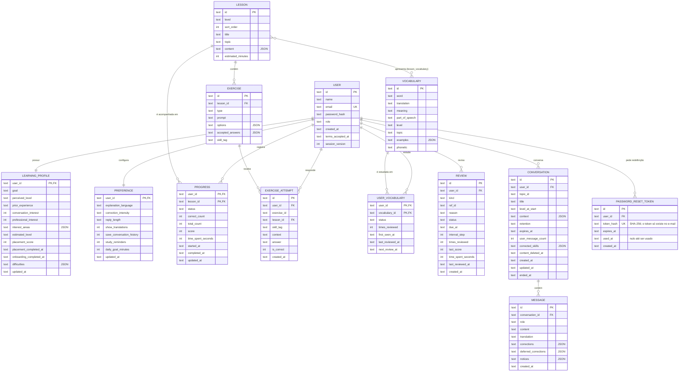
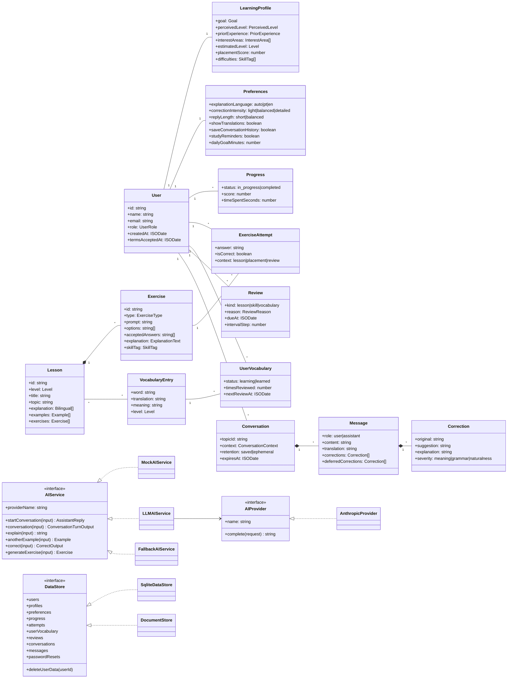

# Modelo de dados — English AI

> Base: Análise de requisitos §20 (Usuário, Perfil de aprendizagem, Aula, Exercício, Vocabulário, Conversação, Progresso) + entidades de apoio necessárias aos casos de uso (ExerciseAttempt, UserVocabulary, Message, Review, Preference).
> O esquema executável está em [`apps/api/src/db/schema.sql`](../apps/api/src/db/schema.sql) e os tipos em [`packages/core/src/domain/entities.ts`](../packages/core/src/domain/entities.ts).

## 1. Rastreabilidade das entidades

| Entidade | Origem nos documentos | Atributos dos documentos | Atributos de apoio (decisão técnica) |
|----------|----------------------|--------------------------|--------------------------------------|
| **User** | §20 Usuário | id, nome, e-mail, credenciais, preferências | `role` (ator Administrador, D7), `terms_accepted_at` (privacidade), `session_version` (encerra sessões ao redefinir a senha) |
| **PasswordResetToken** | UC02 (recuperação de senha) | — | hash SHA-256 do token, validade, uso único (`used_at`), criação — ver [EMAIL-AND-AUTH.md](./EMAIL-AND-AUTH.md) |
| **LearningProfile** | §20 Perfil de aprendizagem, UC03, UC04 | nível, objetivo, dificuldades, progresso | nível percebido, experiência anterior, interesses (UC03), pontuação e data do nivelamento |
| **Preference** | UC12, RF19 | idioma das explicações, intensidade das correções, preferências de conversação, histórico, notificações, aprendizagem | meta diária |
| **Lesson** | §20 Aula | título, nível, conteúdo, tópico, exercícios | ordem (RN02), minutos estimados |
| **Exercise** | §20 Exercício | pergunta, alternativas/resposta esperada | tipo, explicação PT/EN, tema (skill) |
| **ExerciseAttempt** | §20 Exercício ("resposta do usuário, resultado"), UC06 | resposta do usuário, resultado | contexto (aula, nivelamento, revisão), data |
| **Vocabulary** | §20 Vocabulário | palavra, significado, exemplos, nível | tradução, classe gramatical, tópico; `phonetic` preparado (pronúncia futura) |
| **UserVocabulary** | §20 Vocabulário ("frequência de revisão"), RF17 | frequência de revisão | status, vezes revisada, próxima revisão |
| **Conversation** | §20 Conversação | usuário, mensagens, contexto, data, configurações de retenção | assunto, nível no início, metadados mínimos (nº de mensagens, temas corrigidos) |
| **Message** | §20 Conversação ("mensagens") | — | papel, conteúdo, tradução de apoio, correções exibidas e adiadas, avisos |
| **Progress** | §20 Progresso | conteúdos concluídos, desempenho, métricas de estudo | por aula: status, acertos, nota, tempo |
| **Review** | §20 Progresso ("revisões"), UC08 | revisões | tipo, referência, motivo, vencimento, passo do intervalo |

> **Indicadores agregados** (taxa de acertos, dias de estudo, sequência, tempo total, erros recorrentes) **não são armazenados**: são calculados a partir de Progress, ExerciseAttempt, Review, UserVocabulary e Conversation (`packages/core/src/domain/progress.ts`). Em escala, podem ser materializados (ver ARCHITECTURE.md §Escalabilidade).

## 2. DER

### Observações do modelo

- **Exercícios de nivelamento e de vocabulário** não são linhas de `EXERCISE`: são gerados a partir do catálogo (`placement:*`, `vocab:*`). Por isso `exercise_attempt.exercise_id` **não** tem chave estrangeira — apenas `lesson_id` tem. Essa decisão evita criar uma entidade extra de "Nivelamento" não prevista nos documentos; o resultado do nivelamento fica no `LEARNING_PROFILE`.
- **Review.ref_id** é polimórfico (id de aula, tag de tema ou `vocabulary`), conforme `kind`.
- **Exclusão de dados (RF20):** todas as tabelas do usuário usam `ON DELETE CASCADE` a partir de `USER` (inclusive `PASSWORD_RESET_TOKEN`).
- **Recuperação de senha:** `PASSWORD_RESET_TOKEN` guarda só o hash do token; no máximo um pedido ativo por conta (um novo pedido apaga os anteriores); pedidos vencidos há mais de um dia são removidos pela limpeza periódica. `USER.session_version` sobe a cada redefinição e invalida os tokens de sessão emitidos antes.
- **Migrações:** o esquema é idempotente (`CREATE … IF NOT EXISTS`); colunas novas em bancos existentes entram por migrações aditivas em `apps/api/src/db/database.ts` (ex.: `session_version` com padrão 0), sem apagar dados.
- **Retenção (RN07):** ao expirar ou ao ser apagada, uma conversa perde as mensagens e os fatos do contexto; ficam só metadados sem conteúdo (`user_message_count`, `corrected_skills`) para o progresso.
- **Campos JSON**: listas pequenas e de leitura conjunta (interesses, exemplos, correções). Em PostgreSQL, viram `jsonb`.
- **Datas** em ISO 8601 UTC (texto) para portabilidade entre navegador, API e banco.

## 3. Diagrama de classes (domínio e serviços)

## 4. Índices

| Tabela | Índice | Motivo |
|--------|--------|--------|
| users | `UNIQUE(email)` | login e verificação de conta existente (UC01-A2) |
| password_reset_tokens | `UNIQUE(token_hash)` | busca do link pelo hash |
| password_reset_tokens | `(user_id, created_at)` | pedido mais recente da conta (intervalo mínimo entre e-mails) |
| password_reset_tokens | `(expires_at)` | limpeza de pedidos vencidos |
| exercise_attempts | `(user_id, created_at)` | progresso, dificuldades recentes |
| reviews | `(user_id, status, due_at)` | fila de revisão |
| conversations | `(user_id, updated_at)` | histórico |
| conversations | `(expires_at)` parcial onde `content_deleted_at IS NULL` | limpeza por retenção |
| messages | `(conversation_id, created_at)` | leitura da conversa |
