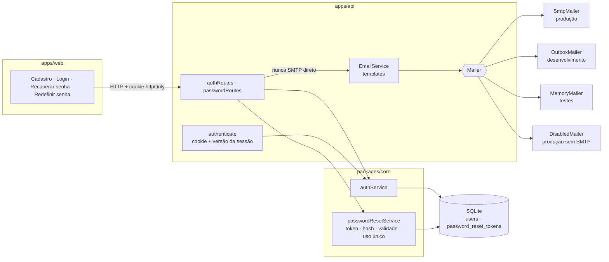
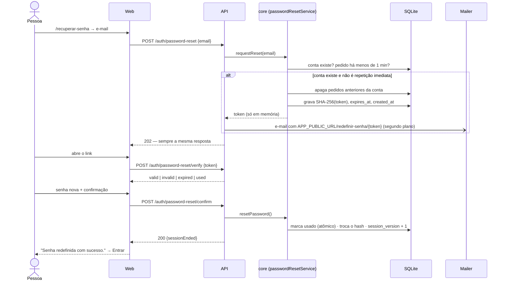

# E-mail e autenticação — English AI

> Como funcionam cadastro, login, sessão, saída, recuperação de senha e o envio de e-mails transacionais.
> Complementa [ARCHITECTURE.md](./ARCHITECTURE.md) (§6.1 trata da sessão e do cache no front-end).

## Sumário

1. [Visão geral](#1-visão-geral)
2. [Cadastro](#2-cadastro)
3. [Login e sessão](#3-login-e-sessão)
4. [Sair da conta](#4-sair-da-conta)
5. [Recuperação de senha](#5-recuperação-de-senha)
6. [Sistema de e-mails](#6-sistema-de-e-mails)
7. [Configuração](#7-configuração)
8. [Modo demonstração](#8-modo-demonstração)
9. [Segurança — resumo](#9-segurança--resumo)
10. [Testes](#10-testes)
11. [Limitações conhecidas](#11-limitações-conhecidas)
12. [Referência de organização (projeto NEXO)](#12-referência-de-organização-projeto-nexo)

---

## 1. Visão geral

- As **regras** (token, validade, uso único, política de senha) ficam no `core`, e valem igual na API e no modo
  demonstração.
- O **envio** fica só na API: as rotas chamam o `EmailService`, que monta a mensagem a partir de um template e
  entrega a um `Mailer`. Nenhuma rota fala com SMTP.

## 2. Cadastro

`POST /api/auth/register` (limite: 20 tentativas por IP a cada 15 minutos, junto com login e exclusão de conta).

1. Validação (`validateRegistration` no core, a mesma usada na tela): nome, e-mail, senha com 8+ caracteres,
   letra e número, confirmação e aceite dos termos.
2. A senha vira hash **scrypt** com salt aleatório; o e-mail é normalizado (minúsculas, sem espaços).
3. A conta é criada com perfil e preferências padrão, e a sessão começa (cookie, §3).
4. **E-mail de boas-vindas** é disparado em segundo plano. É secundário: se o envio falhar, a conta continua
   válida e o erro vai para o log só com o código (`email.failed`, ex.: `ECONNECTION`).

O e-mail de boas-vindas tem o primeiro nome, uma explicação curta, o botão **Começar a estudar** (para
`APP_PUBLIC_URL/entrar`), o aviso de que nunca enviamos senhas e o rodapé. Não contém senha nem link de uso único.

## 3. Login e sessão

`POST /api/auth/login` com o mesmo limite do cadastro. Credenciais erradas recebem sempre a mesma mensagem
("E-mail ou senha incorretos"), e o tempo de resposta é equalizado mesmo quando o e-mail não existe.

A sessão é um **JWT HS256** em cookie `ea_session`:

| Propriedade | Valor |
| --- | --- |
| `httpOnly` | sim — o JavaScript da página não lê o token |
| `SameSite` | `Strict` |
| `Secure` | em produção |
| `path` | `/api` |
| Validade | `AUTH_TOKEN_TTL_HOURS` (padrão 72 h) |
| Conteúdo | `sub` = id da conta, `aud` = `english-ai`, `sv` = **versão da sessão** |

**Versão da sessão.** A tabela `users` tem `session_version` (começa em 0). A cada requisição, o middleware
`authenticate` confere a assinatura, a validade **e** se o `sv` do token é igual à versão atual da conta. Se não
for (senha redefinida) ou se a conta não existir mais (excluída), a requisição é tratada como de visitante: rotas
privadas respondem 401 e `GET /api/auth/session` responde `{ account: null }` e remove o cookie antigo.

- Tokens emitidos antes desta versão não têm `sv` e contam como versão 0: continuam valendo até a primeira troca
  de senha, sem derrubar ninguém na atualização.
- Proteções que já existiam continuam iguais: cabeçalho CSRF (`X-Requested-With: english-ai`), CORS restrito,
  `X-Session-User` (a API recusa dados de outra conta quando o cookie mudou em outra aba), helmet e limites de
  requisição.

## 4. Sair da conta

`POST /api/auth/logout` remove o cookie. No front-end, `endSession('signed_out')` cancela as requisições
privadas, apaga da memória os dados da conta, avisa as outras abas e leva ao login com "Você saiu da sua conta."
Detalhes em [ARCHITECTURE.md §6.1](./ARCHITECTURE.md).

## 5. Recuperação de senha

### 5.1 Pedido — `POST /api/auth/password-reset`

- **Anti-enumeração:** status `202` e o mesmo corpo para qualquer e-mail bem formado:
  `{ "message": "Se existir uma conta com este e-mail, enviaremos as instruções de recuperação.", "expiresInMinutes": 15 }`.
  O e-mail é enviado em segundo plano, então o tempo de resposta não depende de a conta existir. Só um e-mail
  mal formatado recebe `400 VALIDATION` (isso não revela nada sobre contas).
- **Um link ativo por conta:** um novo pedido apaga os anteriores (o link antigo passa a ser "inválido").
- **Sem e-mail repetido em sequência:** se o último pedido da conta tem menos de 60 segundos e ainda vale, nenhum
  e-mail novo é gerado (a resposta é a mesma).
- **Limite por IP:** 10 pedidos a cada 15 minutos (`429` depois disso) — evita usar o sistema para disparar
  e-mails em massa.

### 5.2 Token

| Item | Decisão |
| --- | --- |
| Geração | 32 bytes de `crypto.getRandomValues` (256 bits), em base64url — 43 caracteres |
| Armazenamento | **apenas o hash SHA-256** (`password_reset_tokens.token_hash`, único). Quem lê o banco não consegue usar o link. |
| Busca | pelo hash do valor recebido; formato inválido é recusado antes de consultar o banco |
| Validade | 15 minutos (`PASSWORD_RESET_TTL_MINUTES`, entre 5 e 120) |
| Uso único | `UPDATE … SET used_at = ? WHERE id = ? AND used_at IS NULL`: se duas requisições usarem o mesmo link ao mesmo tempo, só uma troca a senha |
| Onde trafega | no link do e-mail e no **corpo** das requisições (POST), nunca em query string; nunca em logs |
| Limpeza | pedidos vencidos há mais de um dia são apagados pela varredura periódica da API (a cada 6 h); contas excluídas levam os pedidos junto (`ON DELETE CASCADE`) |

Por que não um token assinado sem estado (como `itsdangerous` ou JWT)? Porque ele não permite **uso único** nem
**invalidar links anteriores** sem guardar algo no banco — e esses dois requisitos são obrigatórios aqui.

### 5.3 Situação do link — `POST /api/auth/password-reset/verify`

Responde `valid`, `invalid` (não existe, adulterado ou substituído por um mais novo), `expired` ou `used`. Não
altera nada e fica só sob o limite geral de requisições: com 256 bits, adivinhar um token é inviável.

### 5.4 Senha nova — `POST /api/auth/password-reset/confirm`

1. O link precisa estar `valid`; senão, `400 RESET_TOKEN_INVALID` (a tela consulta a situação e mostra o estado
   certo).
2. A senha nova passa pela **mesma política do cadastro** (`validateNewPassword` no core — não existem duas
   políticas). Erro de validação **não** consome o link.
3. O link é marcado como usado, o hash da senha é trocado e `session_version` sobe.
4. Resposta: `{ "message": "Senha redefinida com sucesso.", "sessionEnded": true|false }`.

### 5.5 Depois da redefinição

- A senha antiga deixa de funcionar; a nova passa a funcionar.
- **Todas as sessões abertas antes da troca deixam de valer**, em qualquer aparelho, porque a versão da sessão
  mudou. Quem estava conectado em outro aparelho vê o fluxo normal de sessão expirada ("Sua sessão expirou. Entre
  novamente para continuar.").
- Se o próprio navegador que redefiniu estava conectado **à mesma conta**, a resposta remove o cookie
  (`sessionEnded: true`) e a interface encerra a sessão também nas outras abas. Uma sessão de **outra** conta no
  mesmo navegador não é afetada.
- O link usado mostra "Este link já foi usado" se for aberto de novo.

### 5.6 Telas

| Rota | Estados |
| --- | --- |
| `/recuperar-senha` (visitantes) | formulário → resposta genérica + "confira a caixa de entrada e o spam; o link vale por N minutos" |
| `/redefinir-senha/:token` (sem guarda de rota: o link abre mesmo com uma sessão ativa) | verificando · formulário · link vencido · link já usado · link inválido · falha ao verificar (com "Tentar de novo") · sucesso (com **Entrar**) |

Depois de entrar, o app nunca devolve a pessoa para um link de redefinição.

## 6. Sistema de e-mails

Código em `apps/api/src/email/`:

| Arquivo | Papel |
| --- | --- |
| `types.ts` | contratos: `EmailMessage` (para, assunto, HTML, texto, tipo), `Mailer` |
| `mailers.ts` | `SmtpMailer`, `OutboxMailer`, `MemoryMailer`, `DisabledMailer` |
| `createMailer.ts` | escolhe o `Mailer` a partir da configuração validada |
| `emailService.ts` | ponto único de envio: `sendWelcome`, `sendPasswordReset`, `idle` |
| `templates/layout.ts` | layout base (cabeçalho com a marca, corpo, botão, aviso, rodapé) e escape de HTML |
| `templates/welcome.ts`, `templates/passwordReset.ts` | conteúdo de cada e-mail, em HTML e em texto puro |

**Comportamento do `EmailService`:**

- **Não bloqueante:** as rotas disparam e respondem; o envio segue em segundo plano. `idle()` aguarda os envios
  pendentes (usado nos testes e no desligamento do servidor).
- **Falha segura:** erro de envio nunca desfaz a ação que o originou. O log registra `email.failed` com o tipo
  (`welcome`/`password_reset`), o transporte e **só o código do erro** — nunca o destinatário, o link, o token ou a
  resposta do servidor SMTP (que pode conter endereço ou credencial).
- Envio bem-sucedido registra `email.sent` (tipo e transporte). Com o envio desativado, `email.skipped`.

**Templates:** tabelas, estilos inline, largura máxima de 600px, nenhuma imagem, CSS ou script externo (clientes
de e-mail ignoram ou bloqueiam), `lang="pt-BR"`, texto de prévia oculto e versão em texto puro. Cores e
tipografia do design system (papel, azul-marinho, marca-texto amarelo, azul do Modo Aprender). Nomes digitados pela
pessoa são escapados (nunca viram HTML).

### 6.1 Transportes

| Transporte | Quando | O que faz |
| --- | --- | --- |
| `smtp` | `SMTP_HOST` preenchido (ou `MAIL_TRANSPORT=smtp`) | envio real com **nodemailer**. Em produção, STARTTLS obrigatório na porta 587 (ou TLS direto com `SMTP_SECURE=true`, porta 465). Log da conversa SMTP sempre desligado (ela inclui a autenticação). Sem acesso a arquivos ou URLs no conteúdo. Tempo limite de conexão de 10 s. |
| `outbox` | padrão em **desenvolvimento** sem SMTP | cada e-mail vira um `.html` (abra no navegador e clique no link) e um `.json` em `MAIL_OUTBOX_DIR` (padrão `./data/outbox`, fora do Git). Nada é enviado. **Recusado em produção** (a API não inicia). |
| `memory` | testes automatizados | guarda as mensagens em memória (`MemoryMailer.messages`, `lastTo(email)`); nada sai do processo |
| `disabled` | produção sem SMTP, e `NODE_ENV=test` | não envia; registra `email.skipped`. A API avisa na inicialização que boas-vindas e recuperação não serão enviadas. |

Os testes (`npm test` e `npm run test:e2e`) **nunca** usam SMTP: os de unidade e integração usam `MemoryMailer`
ou um mailer falso; o servidor dos testes E2E usa a caixa de saída local em `e2e/.output/http/outbox`.

## 7. Configuração

Todas as variáveis ficam no `.env` do servidor (ver `.env.example`, só com valores de exemplo). Nenhuma chega ao
navegador.

| Variável | Padrão | Descrição |
| --- | --- | --- |
| `MAIL_TRANSPORT` | automático (§6.1) | `smtp`, `outbox` ou `disabled` |
| `SMTP_HOST` | — | servidor SMTP; preenchido = envio real |
| `SMTP_PORT` | `587` | porta |
| `SMTP_SECURE` | `false` | `true` para TLS direto (465); `false` usa STARTTLS |
| `SMTP_USER` / `SMTP_PASSWORD` | — | credenciais (precisam vir juntas). Gmail: senha de app, nunca a senha da conta |
| `MAIL_FROM` | `English AI <no-reply@english-ai.local>` em desenvolvimento | remetente; **obrigatório em produção com SMTP** |
| `APP_PUBLIC_URL` | primeira origem de `CORS_ORIGIN` em desenvolvimento | endereço público do front-end, usado nos links; **obrigatório em produção com SMTP**. Os links **nunca** usam o cabeçalho `Host` da requisição (evita links forjados para outro domínio). |
| `MAIL_OUTBOX_DIR` | `./data/outbox` | pasta da caixa de saída local |
| `PASSWORD_RESET_TTL_MINUTES` | `15` | validade do link (5 a 120) |

A configuração é validada na inicialização (`apps/api/src/config/env.ts`): combinações inválidas impedem a API de
subir com uma mensagem clara (ex.: caixa de saída em produção, SMTP sem `APP_PUBLIC_URL`/`MAIL_FROM` em produção,
usuário sem senha).

## 8. Modo demonstração

O modo demonstração roda no navegador e **não envia e-mails** (nem tenta SMTP). A recuperação de senha usa as
mesmas regras do core e a tela mostra, identificado como **"Simulação do modo demonstração — Nenhum e-mail real é
enviado na demonstração"**, o e-mail que seria enviado (destinatário, assunto e o botão para abrir o link). Os
dados e o token existem só no armazenamento local deste navegador. No modo http, a tela nunca mostra o link.

## 9. Segurança — resumo

- [x] Senhas com scrypt; nunca em e-mail, log ou resposta.
- [x] Token de redefinição aleatório de 256 bits; banco guarda só o SHA-256.
- [x] Validade curta, uso único atômico, um link ativo por conta.
- [x] Mesma resposta para e-mail com ou sem conta; envio em segundo plano.
- [x] Limites por IP: cadastro/login/confirmação (20 em 15 min) e pedidos de e-mail (10 em 15 min).
- [x] Redefinir a senha encerra as sessões abertas (versão da sessão).
- [x] Links montados com `APP_PUBLIC_URL`, nunca com o cabeçalho `Host`.
- [x] Token só no corpo das requisições; logs sem token, e-mail, link ou resposta SMTP.
- [x] Credenciais SMTP só no backend; log SMTP desligado; caixa de saída local proibida em produção.
- [x] CSRF (cabeçalho), CORS restrito, helmet (inclui `Referrer-Policy: no-referrer` quando a API serve a
  interface), cookie httpOnly/SameSite=Strict/Secure em produção.

## 10. Testes

| Onde | O que cobre |
| --- | --- |
| `packages/core/test/passwordReset.test.ts` | link só para conta existente, hash no armazenamento, novo pedido invalida o anterior, intervalo mínimo, válido/inválido/adulterado/vencido/usado, limite exato da validade, política de senha, uso único com envios simultâneos, versão da sessão, limpeza |
| `apps/api/test/passwordReset.test.ts` | respostas iguais com e sem conta, e-mail só para conta existente, conteúdo do e-mail, link com `APP_PUBLIC_URL` e não com `Host`, token fora de logs e respostas, limite por IP (429), jornada completa, senha antiga recusada, link reutilizado recusado, sessões antigas encerradas em todos os aparelhos, cookie removido no próprio navegador, sessão de outra conta preservada, boas-vindas, falha de SMTP no cadastro e na recuperação, compatibilidade com cookies antigos |
| `apps/api/test/email.test.ts` | templates (conteúdo, escape, layout compatível), `EmailService` (link, logs, falha não bloqueante, envio desativado), `SmtpMailer` (campos enviados ao nodemailer), caixa de saída local, regras de configuração |
| `apps/api/test/storage.test.ts` | migração de banco antigo sem perder dados, uso único atômico no SQLite, limpeza |
| `apps/web/test/passwordReset.test.tsx` | telas de recuperação e redefinição nos dois modos, todos os estados do link, política de senha, falha de rede, sessão ativa no mesmo navegador |
| `e2e/http.spec.ts` | link lido da caixa de saída local → senha nova; sessão do outro aparelho encerrada; senha antiga recusada; link de uso único; e-mail sem conta não gera mensagem; e-mail de boas-vindas no cadastro |
| `e2e/demo.spec.ts` | recuperação simulada na demonstração, sem fingir envio |

## 11. Limitações conhecidas

- Não há confirmação de e-mail no cadastro (o e-mail de boas-vindas não pede verificação).
- O envio é feito no próprio processo da API, sem fila nem nova tentativa automática; uma falha fica registrada no
  log e a pessoa pode pedir outro link.
- Os limites de requisição ficam em memória: com várias instâncias da API, use um armazenamento compartilhado.
- Sair da conta remove o cookie do navegador, mas não invalida o token no servidor; um token copiado continuaria
  válido até vencer (72 h por padrão) ou até a senha ser redefinida.
- SPF, DKIM e DMARC do domínio remetente dependem do provedor de e-mail e do DNS — fora do código.
- A pasta da caixa de saída local não é limpa automaticamente (é só de desenvolvimento).
- O envio real por SMTP foi testado com o transporte do nodemailer em memória (sem rede), não contra um servidor
  SMTP de verdade neste ambiente.

## 12. Referência de organização (projeto NEXO)

O projeto NEXO (Flask) serviu de referência de organização e de qualidade, sem copiar código, textos, identidade
visual ou regras.

| Aproveitado (a ideia) | Como ficou no English AI |
| --- | --- |
| Módulo central de e-mail com "falha segura" | `EmailService` + `Mailer`; erro de envio nunca quebra o fluxo |
| Envio fora da requisição | envio em segundo plano com `idle()` para testes e desligamento |
| Layout base de e-mail (cabeçalho, corpo, botão, aviso, rodapé) | `templates/layout.ts`, com a identidade do English AI |
| Log SMTP desligado para não vazar credenciais | `logger: false, debug: false` no transporte |
| Configuração centralizada e documentada | `config/env.ts` validado + `.env.example` comentado |
| Resposta genérica e limite de tentativas na recuperação | mantido e reforçado (limite próprio para pedidos de e-mail) |

| Não copiado (de propósito) | Motivo |
| --- | --- |
| Token assinado sem estado | não permite uso único nem invalidar links anteriores |
| Link completo (com token) registrado no log e exibido na tela em modo de depuração | vazaria o token; aqui o token nunca vai para log, e a demonstração mostra uma simulação identificada |
| Link montado a partir do cabeçalho `Host` | permite links forjados; aqui só `APP_PUBLIC_URL` |
| Troca de senha sem encerrar sessões | aqui a versão da sessão encerra todas |
| Políticas de senha diferentes por tela | aqui uma única política (`validateNewPassword`) |
