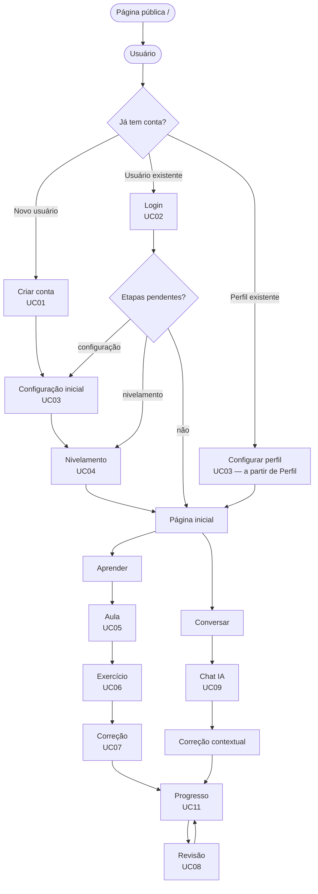
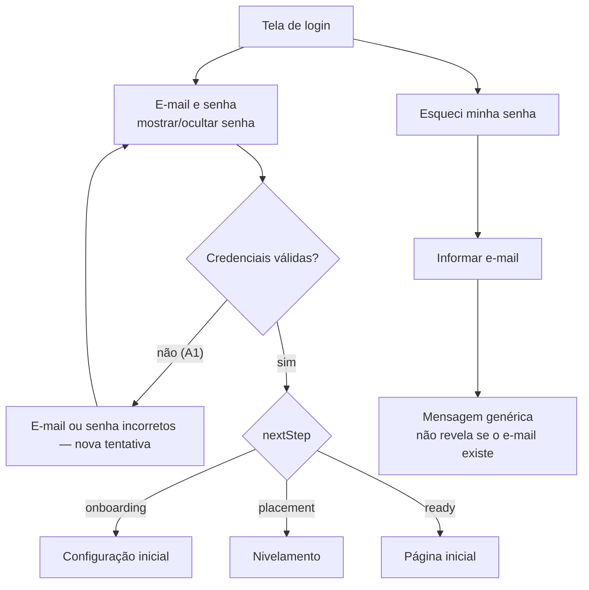
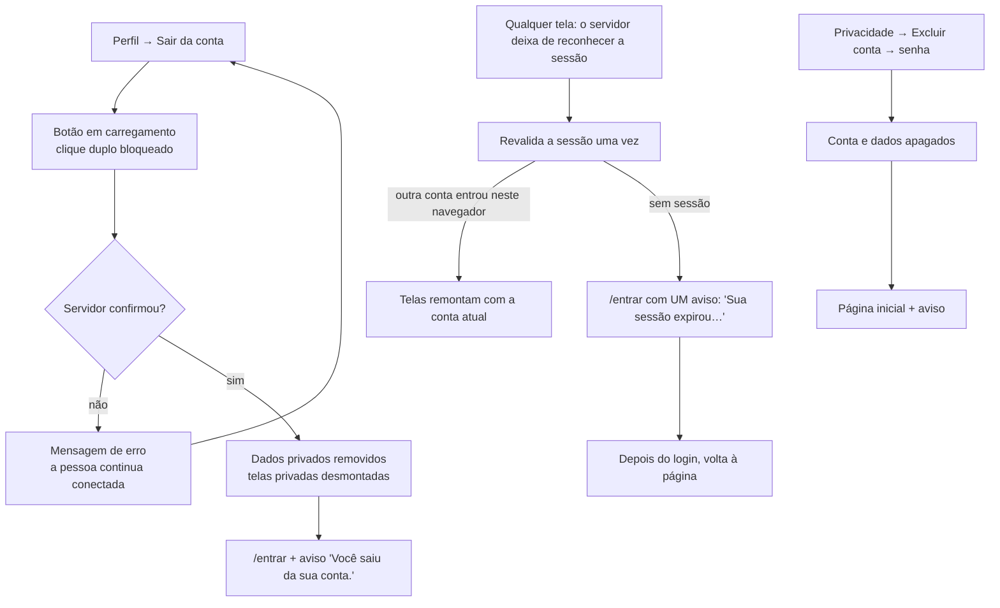
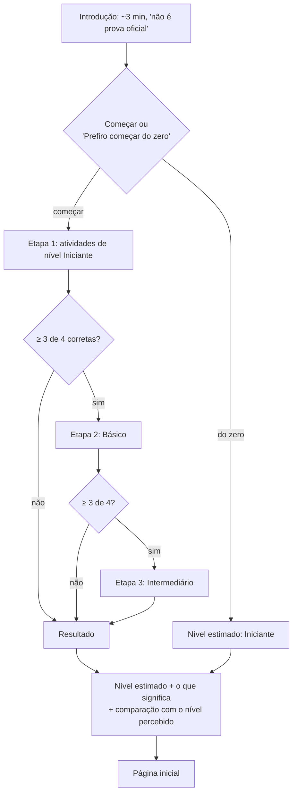
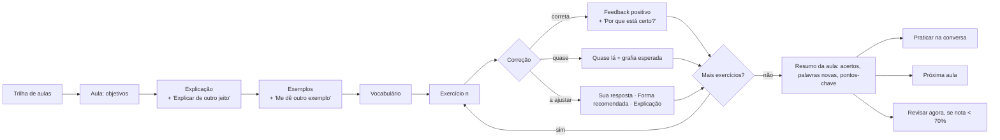
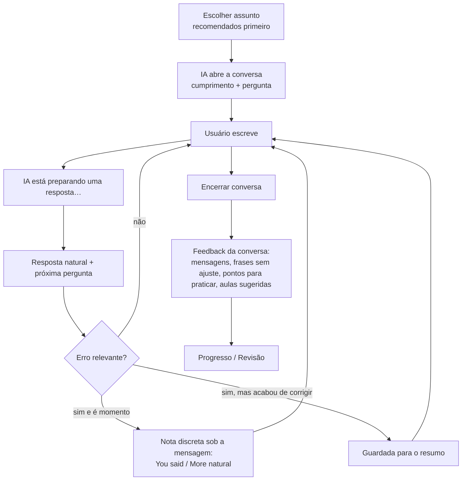

# Fluxos de usuário — English AI

> **Transição para Python:** os requisitos e as decisões acadêmicas deste documento
> foram preservados. A implementação atual roda com Flask/Jinja na raiz; a versão
> anterior e seus detalhes de framework estão em [legacy/USER-FLOWS.md](legacy/USER-FLOWS.md).
> Evidências da nova execução ficam em [MIGRATION-AUDIT.md](MIGRATION-AUDIT.md),
> não nas contagens/capturas históricas do protótipo TypeScript.

> Base: Fluxograma de caso de uso (F3), Especificação de Casos de Uso UC01–UC12 (F2) e Análise de requisitos §12–13 (F1). As decisões sobre pontos divergentes estão em [MVP-SCOPE.md §5](./MVP-SCOPE.md#5-divergências-entre-os-materiais-e-decisões-tomadas).

## 1. Fluxo principal (fluxograma do projeto)



A porta de entrada é a página pública (`/`), com "Começar gratuitamente", "Já tenho conta".
Na versão Python, cadastre uma conta para navegar; o provedor demonstrativo é
identificado, com dados persistidos no servidor. Quem já tem sessão e abre `/`
vai direto para a etapa pendente (ou para o Início) — a página pública é só para visitantes.

Regra: **o usuário nunca repete uma etapa concluída automaticamente**. O serviço
calcula `nextStep` (`onboarding` → `placement` → `ready`) a partir do perfil
persistido, e as rotas protegidas redirecionam para a etapa pendente. Editar perfil
e refazer o nivelamento continuam disponíveis por escolha do usuário.

## 2. Cadastro (UC01)

```mermaid
flowchart TD
    A[Tela de cadastro] --> B[Nome, e-mail, senha,<br/>confirmação, aceite dos termos]
    B --> C{Validação no app<br/>em tempo real}
    C -- inválido (A1) --> D[Mensagem junto ao campo] --> B
    C -- válido --> E[Enviar — botão em carregamento]
    E --> F{API valida de novo}
    F -- inválido (A1) --> D
    F -- conta existe (A2) --> G[Aviso + atalho "Entrar com este e-mail"]
    F -- criada --> H[Feedback "Conta criada!"] --> I[Configuração inicial]
    F -- criada --> W[E-mail de boas-vindas em segundo plano<br/>outbox local ou SMTP configurado · falha não desfaz a conta]
```

## 3. Login (UC02) e recuperação de senha



### 3.0 Recuperação de senha

```mermaid
flowchart TD
    A[/recuperar-senha/] --> B[E-mail] --> C["Resposta igual para qualquer e-mail:<br/>'Se existir uma conta…'"]
    C -- SMTP configurado, conta existe --> D[E-mail com link<br/>vale 15 min · uso único]
    C -- desenvolvimento sem SMTP --> E[Caixa de saída local<br/>nenhum e-mail real é enviado]
    D --> F[/redefinir-senha/:token/]
    E --> F
    F --> G{Situação do link}
    G -- inválido / vencido / já usado --> H[Explicação + "Pedir um novo link"]
    G -- válido --> I[Nova senha + confirmação<br/>mesma política do cadastro]
    I -- erro de validação --> I
    I -- ok --> J["'Senha redefinida com sucesso.' + Entrar"]
    J --> K[Sessões antigas encerradas em todos os aparelhos]
```

- Um novo pedido invalida o link anterior; pedidos repetidos em menos de 1 minuto não geram outro e-mail.
- A senha antiga deixa de funcionar na hora. Quem estava conectado em outro aparelho vê "Sua sessão expirou" na
  próxima ação; se este navegador estava conectado à mesma conta, a sessão termina aqui e nas outras abas.
- O link abre mesmo com uma sessão ativa; depois de entrar, o app nunca volta para um link de redefinição.

Detalhes técnicos: [EMAIL-AND-AUTH.md](./EMAIL-AND-AUTH.md).

Se a pessoa tentou abrir uma página protegida sem sessão (ou a sessão expirou), o login a leva de volta a essa
página depois de entrar — se a conta já tiver concluído a configuração e o nivelamento.

### 3.1 Sair, sessão expirada e exclusão



- "Sair" nunca mostra "sessão expirou"; o botão Voltar do navegador não revela telas privadas depois de sair ou
  excluir a conta (as guardas levam ao login).
- Abas do mesmo navegador acompanham login, logout e exclusão feitos em outra aba.

## 4. Configuração inicial (UC03)

Três passos curtos com indicador de progresso; "Voltar" preserva as escolhas.

1. **Objetivo** — aprender o básico, conversar, trabalho, viagem, tecnologia (escolha única).
2. **Sua experiência** — nível percebido (inclui "Não sei dizer") e experiência anterior.
3. **Interesses** — interesse em conversação, interesse profissional e até 3 áreas.

Resultado: perfil salvo → Nivelamento. Depois, o mesmo formulário fica em **Perfil → Editar perfil de aprendizagem**.

**Sair durante o primeiro acesso.** Configuração inicial e nivelamento são etapas obrigatórias: não há outra
tela para onde voltar. Por isso o "X" se chama **Sair da conta**, pede confirmação e realmente encerra a sessão;
ao entrar de novo, a pessoa retoma a etapa pendente. Na edição do perfil, o "X" é **Cancelar edição** (volta ao
Perfil sem salvar); ao refazer o nivelamento pelo Perfil, sair volta ao Perfil mantendo o nível atual.

## 5. Nivelamento (UC04)



O resultado é sempre apresentado como **"nível estimado"** e salvo no perfil. Pode ser refeito em Perfil.

## 6. Modo Aprender (UC05, UC06, UC07)



- A aula guarda o andamento: sair e voltar mostra **"Continuar de onde parei"** no Início.
- Exercícios abertos ("Escreva sua resposta") são analisados pela IA/regras e mostram a correção no formato do documento: *Sua frase / Forma recomendada / Explicação*.

## 7. Modo Conversação (UC09)



Atalhos: **"Praticar isso"** no fim de uma aula abre uma conversa já com o tema da aula. Com o histórico desativado, o conteúdo é apagado ao encerrar.

## 8. Revisão (UC08)

Início ou Progresso → "Você tem N conteúdos para revisar" → lista com **motivo** de cada item → sessão de 3–6 atividades → resultado e próxima data → progresso atualizado.

## 9. Vocabulário (UC10)

Vocabulário → filtros (Todas · Para revisar · Aprendidas) e busca → palavra → tradução, significado, exemplo, nível, status, aula de origem → "Já aprendi" / "Quero revisar". Sugestões do nível do usuário aparecem abaixo da lista.

## 10. Progresso (UC11)

Progresso (aba principal ou Perfil → Seu progresso) → resumo (nível estimado e avanço no nível) → números principais → últimos 7 dias → desempenho por tema → precisa revisar → aulas recentes.

## 11. Preferências e dados (UC12, RF20)

Perfil → Preferências → idioma das explicações · intensidade das correções ·
preferências de conversa · histórico · lembretes · meta diária → salvo
automaticamente com confirmação. As alterações são enviadas em ordem, uma por
vez; falha mostra uma mensagem acionável e restaura o valor salvo do campo,
sem apresentar sucesso. A preferência de lembretes não dispara envio no MVP.
Perfil → Privacidade e dados → o que coletamos → apagar histórico de conversas → excluir conta (confirmação com senha).
